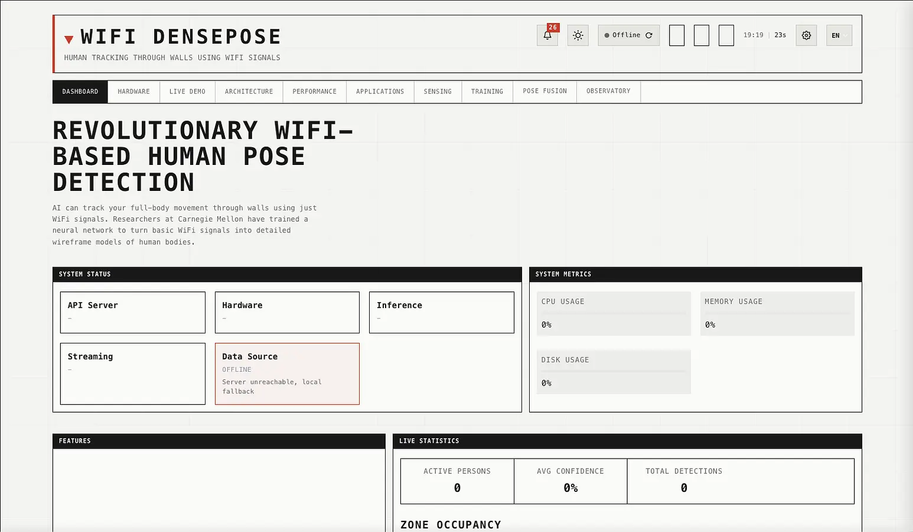
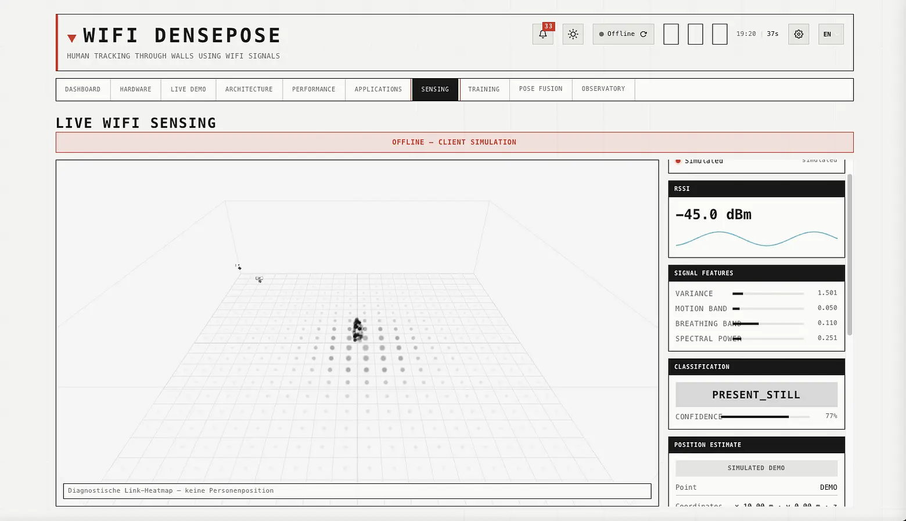

# Observatory
[](https://stardance.hackclub.com/projects/25673)
[](https://www.espressif.com/en/products/socs/esp32)
[](#aktueller-validierungsstand)


Ein experimentelles 1TX-/4RX-WLAN-CSI-System, das Präsenz, Bewegung und neun
feste Raumpositionen ohne Kamera untersucht und mmWave nur als unabhängige
Referenz verwendet.
> **You are being sensed.**
>
> This room has a secret system, a machine that watches the Wi-Fi every second
> it is running. I know because I built it.
>
> I designed the machine to detect movement, but it sees every disturbance.
> Reflections caused by ordinary people—people like you. Signals the old
> algorithms considered “irrelevant.”
>
> They couldn’t understand them, so I decided I would. But I needed a partner,
> another sensor with the precision to reveal the truth.
>
> Bound by physics, we work without cameras. You’ll never see us. But moving or
> motionless, if you change the signal… we’ll find *you*.

*Nach dem Intro der Serie
[*Person of Interest*](https://en.wikipedia.org/wiki/Person_of_Interest_(TV_series)).*

*Die fünf ESP32-S3-Boards des Aufbaus: ein Sender und vier
CSI-Empfänger.*


## Projekt ansehen

**[Observatory auf Stardance ansehen](https://stardance.hackclub.com/projects/25673)**

Eine öffentliche Live-Demo gibt es derzeit nicht: Die echte Messung benötigt
den festen lokalen Raumaufbau mit TX, RX1 bis RX4 und dem Referenzsensor. Der
[aktuelle technische Wiedereinstieg](08-aktueller-arbeitsstand-d6-und-position.md)
zeigt, was bereits real geprüft wurde und welches Hardware-Gate als Nächstes
folgt.


## Forschungsfrage

Wie zuverlässig kann ein ESP32-basiertes WLAN-CSI-System Bewegungen und
Atemrhythmen im Raum erfassen, und welche physikalischen Grenzen ergeben sich
dabei?

## Schnelleinstieg

Dieses Repository enthält die Berichtsdokumentation und benötigt keinen Build:

```bash
git clone https://github.com/Gerafftes/Observatory.git
cd Observatory
```

Danach sind diese drei Einstiegspunkte am wichtigsten:

1. [Aktueller D6-/mmWave-Arbeitsstand](08-aktueller-arbeitsstand-d6-und-position.md)
2. [Ergebnisberichte](results/)
3. [PCB-01-Fertigungsdaten](hardware/pcb-01/)

Die verwendete RX-Firmware und der Sensing-Server stammen aus dem separaten
Upstream-Projekt [ruvnet/RuView](https://github.com/ruvnet/RuView). Die lokalen
Projektanpassungen sind unter
[`06-ruview-anpassungen.md`](06-ruview-anpassungen.md) dokumentiert.

## Was Observatory kann

- Raw-CSI von vier ESP32-S3-Empfängern verlustfrei und aufbaugebunden
  erfassen.
- Paketquelle, RX-Identität, Subcarrier-Raster, Datenrate und Drops vor einer
  Messung prüfen.
- Bewegung, Still-Präsenz und Position als getrennte Evidenzstufen behandeln.
- Position ausschließlich als P01 bis P09, `unknown` oder `ambiguous`
  ausgeben, statt eine scheinpräzise kontinuierliche Heatmap zu erfinden.
- Training, Blindvorhersage und Wahrheit durch getrennte Dateien und
  Hashbindungen voneinander isolieren.
- Einen HLK-LD2450 als Kalibrierungs- und Referenzsensor verwenden, ohne seine
  Werte in den späteren WLAN-CSI-Prädiktor einzuspeisen.

## Benutzeroberfläche

### Dashboard im Offline-Fallback

Das Dashboard zeigt Systemstatus, Datenquelle und Laufzeitmetriken. Diese
Aufnahme dokumentiert den korrekt sichtbaren Offline-Fallback; sie ist kein
Nachweis eines verbundenen Sensorsystems.



### Sensing in der Client-Simulation

Die Sensing-Ansicht trennt die diagnostische Link-Heatmap von einer echten
Personposition. Die dargestellten Werte stammen ausdrücklich aus der
Client-Simulation und sind keine reale Messung.



### mmWave-Kalibrierungsassistent

Der Assistent führt durch Verbindung, Ausrichtung, Abdeckung, Zonen, Training,
Blindtest und Ergebnis. Der Screenshot zeigt den geprüften Fehlerzustand
`Server nicht erreichbar` mit HTTP 502, nicht eine verbundene Radaraufnahme.


## Aktueller Validierungsstand

**Stand: 14. August 2026**

| Bereich | Status | Was dieser Status belegt |
|---|---|---|
| 1 TX / 4 RX | Transport nachgewiesen | Alle vier RX lieferten gebundene Raw-CSI-Daten im gemeinsamen Raster. |
| D4 Bewegung | Experimentell | Grobe Bewegungsalarme wurden reduziert; Still-Präsenz bleibt unzuverlässig. |
| D5 Still-Präsenz | Livetest nicht bestanden | Bei anwesender stiller Person blieben 350 von 350 Samples `ABSENT`. |
| D6 Position | Software vorbereitet | Aufnahmen, neun Punkte und Blindtests sind implementiert; ein realer blind bestandener Index fehlt. |
| mmWave-Referenz | Teilweise in Betrieb | ESP32-C3, CSI-WLAN und Statusdienst sind nachgewiesen; der reale LD2450-Datenpfad ist noch nicht vollständig validiert. |
| Gesamtsystem | Nicht validiert | Es gibt noch keinen gemeinsamen realen PASS für Classification, Position und mmWave. |

Softwaretests, ein erfolgreicher Flashvorgang oder eine verlustfreie
Übertragung gelten hier ausdrücklich nicht als Nachweis realer Sensor- oder
Positionsgenauigkeit.

## Wie es funktioniert

WLAN-Signale verändern sich durch Reflexion, Abschattung und Multipath. Ein
TX-Board erzeugt den kontrollierten Funkverkehr; RX1 bis RX4 messen die
komplexen CSI-Werte aus verschiedenen Raumpositionen. Observatory vergleicht
diese Messungen mit einer aufbaugebundenen Leerraumreferenz.

Die Positionsbestimmung ist absichtlich diskret. Statt zwischen ungemessenen
Koordinaten zu interpolieren, lernt D6 Fingerprints für neun markierte
Bodenpunkte. Reicht die Evidenz nicht aus oder passen mehrere Punkte ähnlich
gut, muss das System `unknown` oder `ambiguous` ausgeben.

Der mmWave-Sensor dient nur als unabhängige Referenz für Kalibrierung und
Blindbewertung. Dadurch wird verhindert, dass der WLAN-CSI-Prädiktor während
des Tests indirekt die richtige Antwort erhält.

```text
physischer Aufbau
→ Setup-Siegel
→ 25-s-Preflight
→ 65-s-Leerraumkalibrierung
→ P01–P09-Training
→ Positionsindex
→ Blindtests
→ gemeinsame Qualitätsgates
→ Live-Anzeige
```

## Belastbare Ergebnisse

- Die technische Discovery vom 9. August lieferte `2.612` Frames von RX1 bis
  RX4 bei `0` Drops. Das belegt Transport, Bindung und Rasterstabilität, nicht
  die Erkennungs- oder Positionsgüte.
- Zwei historische versiegelte D6-Preflights bestanden mit `2.545`
  beziehungsweise `2.701` Frames und jeweils `0` Drops.
- Eine 65-Sekunden-Leerraumkalibrierung schrieb `6.102` Frames bei `0` Drops
  und bestand die strikte Offline-Inspektion.
- Der erste reale D5-Still-Livetest erreichte `0 %` Still-Recall. D5 bleibt
  deshalb deaktiviert und experimentell.
- Durch die spätere Ergänzung von ESP32-C3, PCB und mmWave-Hardware ist der
  aktuelle physische Aufbau verändert und noch nicht als Setup v2 versiegelt.

Wichtige Nachweise:

- [D5: Offline-Replay und experimentelle Präsenzkalibrierung](results/2026-07-26_D5_offline-replay-und-experimentelle-praesenzkalibrierung.md)
- [D5: realer Still-Livetest](results/2026-07-26_D5_realer-still-livetest.md)
- [D6: Setupaufnahme und TX-Firmwareidentität](results/2026-08-09_D6_setupaufnahme-und-TX-firmwareidentitaet.md)
- [D6: Setup-Siegel und Preflight](results/2026-08-09_D6_setup-siegel-und-preflight.md)
- [D6: Sidecar-Fix, Neusiegelung und Leerraumkalibrierung](results/2026-08-09_D6_sidecar-fix-neusiegelung-und-preflight.md)

## Hardware

Der WLAN-CSI-Aufbau besteht aus fünf ESP32-S3-Boards. Ein separates ESP32-C3-
Board bindet den HLK-LD2450 später als unabhängigen Referenzsensor an.


PCB-01 verbindet den ESP32-C3 mit dem mmWave-Referenzpfad. Die folgende
Fertigungsvorschau zeigt den verwendeten Platinenstand:


Die [Gerber- und Bohrdaten von PCB-01](hardware/pcb-01/) liegen mit SHA-256 und
Fertigungshinweis im Repository.

## Dokumentation

| Datei | Inhalt |
|---|---|
| [`00-status-und-annahmen.md`](00-status-und-annahmen.md) | Aufbau, Annahmen, Koordinaten und offene Punkte |
| [`01-projektjournal.md`](01-projektjournal.md) | Chronologischer Entwicklungsverlauf |
| [`02-versuchslog.md`](02-versuchslog.md) | Durchgeführte Versuche |
| [`03-messprotokoll.md`](03-messprotokoll.md) | Messabläufe und Qualitätsregeln |
| [`04-auswertung-bis-problemfrage.md`](04-auswertung-bis-problemfrage.md) | Auswertung entlang der Forschungsfrage |
| [`05-erfolge-niederlagen-und-aenderungen.md`](05-erfolge-niederlagen-und-aenderungen.md) | Erfolge, Fehlschläge und Kursänderungen |
| [`06-ruview-anpassungen.md`](06-ruview-anpassungen.md) | Lokale Änderungen an RuView |
| [`07-screenshot-nachweise.md`](07-screenshot-nachweise.md) | Visuelle Nachweise und Fehlerbilder |
| [`08-aktueller-arbeitsstand-d6-und-position.md`](08-aktueller-arbeitsstand-d6-und-position.md) | Verbindlicher D6-/mmWave-Wiedereinstieg |
| [`results/`](results/) | Ausführliche Ergebnisberichte |
| [`templates/messblatt.md`](templates/messblatt.md) | Vorlage für neue Messungen |

## Credits

- [ruvnet/RuView](https://github.com/ruvnet/RuView) stellt die Softwarebasis
  für RX-Firmware und Sensing-Server bereit.
- [Espressif](https://www.espressif.com/en/products/socs/esp32) entwickelt die
  verwendeten ESP32-Plattformen.
- Der filmische Prolog ist vom Intro der Serie
  [*Person of Interest*](https://warnertv.de/serie/sendungen/person-of-interest)
  inspiriert.

## Dokumentationsregeln

- Fehlversuche bleiben dokumentiert, weil sie technische und physikalische
  Grenzen sichtbar machen.
- Rohdaten werden erst veröffentlicht, wenn Umfang, Datenschutz und
  Reproduzierbarkeit geprüft sind.
- Geheimnisse, WLAN-Zugangsdaten und private Gerätekennungen gehören nicht in
  die Veröffentlichung.
