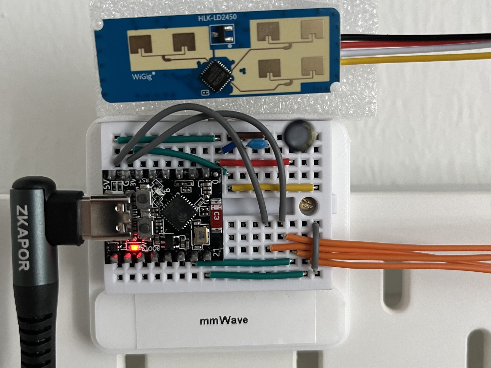

<h1 align="center">Observatory</h1>

<p align="center">
  Ein experimentelles 1TX-/4RX-WLAN-CSI-System, das Präsenz, Bewegung und neun
  feste Raumpositionen ohne Kamera untersucht und mmWave als unabhängige
  Referenz nutzt.
</p>

<p align="center">
  <a href="https://stardance.hackclub.com/projects/25673">Stardance</a> ·
  <a href="#schnelleinstieg">Schnellstart</a> ·
  <a href="#was-observatory-kann">Features</a> ·
  <a href="results/README.md">Ergebnisse</a> ·
  <a href="hardware/README.md">Hardware</a> ·
  <a href="README.en.md">English</a>
</p>

<p align="center">
  <a href="https://stardance.hackclub.com/projects/25673"></a>
  <a href="https://www.espressif.com/en/products/socs/esp32"></a>
  <a href="#aktueller-validierungsstand"></a>
  <a href="LICENSE.md"></a>
  <a href="https://github.com/Gerafftes/Observatory"></a>
  <a href="https://octocounts.com/github/Gerafftes/Observatory/tree/main"></a>
</p>

<table>
  <tr>
    <td align="center" width="50%">
      <a href="images/esp32-s3-boards.jpeg"></a><br>
      <sub>ESP32-S3-Boards: RX1 bis RX4 und TX</sub>
    </td>
    <td align="center" width="50%">
      <a href="images/mmwave-breadboard-setup.jpeg"></a><br>
      <sub>Vorläufiger mmWave-Breadboard-Aufbau</sub>
    </td>
  </tr>
</table>

## Projekt ansehen

**[Observatory auf Stardance ansehen](https://stardance.hackclub.com/projects/25673)**

Eine öffentliche Live-Demo gibt es derzeit nicht: Die echte Messung benötigt
den festen lokalen Raumaufbau mit TX, RX1 bis RX4 und dem Referenzsensor. Der
[aktuelle technische Wiedereinstieg](08-aktueller-arbeitsstand-d6-und-position.md)
zeigt, was bereits real geprüft wurde und welches Hardware-Gate als Nächstes
folgt.

> **You are being sensed.**
>
> This room has a secret system, a machine that watches the Wi-Fi every second
> it is running. I know because I built it.
>
> I designed the machine to detect movement, but it sees every disturbance.
> Reflections caused by ordinary people—people like you. Signals the old
> algorithms considered “irrelevant.”
>
> They couldn’t understand them, so I decided I would. But I needed a partner,
> another sensor with the precision to reveal the truth.
>
> Bound by physics, we work without cameras. You’ll never see us. But moving or
> motionless, if you change the signal… we’ll find *you*.

*Nach dem Intro der Serie
[*Person of Interest*](https://en.wikipedia.org/wiki/Person_of_Interest_(TV_series)).*

## Inhaltsverzeichnis

- [Projekt ansehen](#projekt-ansehen)
- [Schnelleinstieg](#schnelleinstieg)
- [Was Observatory kann](#was-observatory-kann)
- [Lokale Checks](#lokale-checks)
- [Forschungsfrage](#forschungsfrage)
- [Aktueller Validierungsstand](#aktueller-validierungsstand)
- [Benutzeroberfläche](software/experiment-cockpit.md)
- [Wie es funktioniert](architecture.md)
- [Belastbare Ergebnisse](results/README.md)
- [Hardware](hardware/README.md)
- [Dokumentation](#dokumentation)
- [Lizenz](#lizenz)
- [Credits](#credits)
- [Dokumentationsregeln](#dokumentationsregeln)

## Schnelleinstieg

Dieses Repository enthält Dokumentation, Hardwaredateien und den vollständigen
Observatory-Softwarestand:

```bash
git clone https://github.com/Gerafftes/Observatory.git
cd Observatory
```

Die Dokumentation kann direkt gelesen werden. UI und Backend liegen gemeinsam
unter [`software/ruview/`](software/README.md). Ein Softwaretest ohne Hardware
lässt sich so starten:

```bash
cd software/ruview/v2
cargo run -p wifi-densepose-sensing-server --no-default-features -- \
  --source simulate --http-port 3002 --ws-port 3001
```

Danach ist die Sensing-UI unter
`http://127.0.0.1:3002/ui/index.html#sensing` erreichbar.

> [!NOTE]
> Der Lauf mit `--source simulate` prüft UI und Workflow ohne Hardware. Er bleibt ausdrücklich `SOFTWARE-ONLY / UNVALIDATED` und ersetzt kein Hardware-Gate.

Die wichtigsten Einstiegspunkte sind:

1. [UI, Backend und Firmware](software/README.md)
2. [Aktueller D6-/mmWave-Arbeitsstand](08-aktueller-arbeitsstand-d6-und-position.md)
3. [Ergebnisberichte](results/)
4. [PCB-01-Fertigungsdaten](hardware/pcb-01/)
5. [PCB-02-Fertigungsdaten und KiCad-Quellen](hardware/pcb-02/)

Die Software basiert auf [ruvnet/RuView](https://github.com/ruvnet/RuView), ist
aber mit den Observatory-Anpassungen und den benötigten Unterprojekten direkt
im Repository enthalten. Herkunft und festgeschriebene Quellstände stehen in
[`software/README.md`](software/README.md); die Projektanpassungen sind unter
[`06-ruview-anpassungen.md`](06-ruview-anpassungen.md) dokumentiert.

## Was Observatory kann

- Raw-CSI von vier ESP32-S3-Empfängern verlustfrei und aufbaugebunden
  erfassen.
- Paketquelle, RX-Identität, Subcarrier-Raster, Datenrate und Drops vor einer
  Messung prüfen.
- Bewegung, Still-Präsenz und Position als getrennte Evidenzstufen behandeln.
- Position ausschließlich als P01 bis P09, `unknown` oder `ambiguous`
  ausgeben, statt eine scheinpräzise kontinuierliche Heatmap zu erfinden.
- Training, Blindvorhersage und Wahrheit durch getrennte Dateien und
  Hashbindungen voneinander isolieren.
- Einen HLK-LD2450 als Kalibrierungs- und Referenzsensor verwenden, ohne seine
  Werte in den späteren WLAN-CSI-Prädiktor einzuspeisen.

## Lokale Checks

Der enthaltene Softwarestand lässt sich aus dem Repository heraus prüfen:

```bash
sh scripts/verify_observatory_source.sh
node --test software/ruview/ui/tests/*.test.mjs
cargo check --manifest-path software/ruview/v2/Cargo.toml \
  -p wifi-densepose-sensing-server --no-default-features
python3 -m unittest scripts/tests/test_evaluate_d5_replay.py
```

> [!WARNING]
> Die Checks verarbeiten keine neuen Sensorsignale. Ein bestandener Softwaretest, Flashvorgang oder Transportnachweis beweist keine Live-Hardware- oder Positionsgenauigkeit.

## Forschungsfrage

Wie zuverlässig kann ein ESP32-basiertes WLAN-CSI-System Bewegungen und
Atemrhythmen im Raum erfassen, und welche physikalischen Grenzen ergeben sich
dabei?

## Aktueller Validierungsstand

**Stand: 14. August 2026**

| Bereich | Status | Was dieser Status belegt |
|---|---|---|
| 1 TX / 4 RX | Transport nachgewiesen | Alle vier RX lieferten gebundene Raw-CSI-Daten im gemeinsamen Raster. |
| D4 Bewegung | Experimentell | Grobe Bewegungsalarme wurden reduziert; Still-Präsenz bleibt unzuverlässig. |
| D5 Still-Präsenz | Livetest nicht bestanden | Bei anwesender stiller Person blieben 350 von 350 Samples `ABSENT`. |
| D6 Position | Software vorbereitet | Aufnahmen, neun Punkte und Blindtests sind implementiert; ein realer blind bestandener Index fehlt. |
| mmWave-Referenz | Teilweise in Betrieb | ESP32-C3, CSI-WLAN und Statusdienst sind nachgewiesen; der reale LD2450-Datenpfad ist noch nicht vollständig validiert. |
| Gesamtsystem | Nicht validiert | Es gibt noch keinen gemeinsamen realen PASS für Classification, Position und mmWave. |

Softwaretests, ein erfolgreicher Flashvorgang oder eine verlustfreie
Übertragung gelten hier ausdrücklich nicht als Nachweis realer Sensor- oder
Positionsgenauigkeit.

## Benutzeroberfläche

Das Observatory-UI enthält den mmWave-Kalibrierungsassistenten und das
Experiment-Cockpit für Setup-Profil, WiFi-Workflow, Blindaufnahmen und
Evaluation. Die Screenshots und die vollständige Kurzanleitung stehen auf der
[separaten Cockpit-Seite](software/experiment-cockpit.md).

<a href="software/experiment-cockpit.md"></a>

> [!NOTE]
> Die UI-Abbildungen und der Demo-Ablauf zeigen Softwarezustände ohne angeschlossene Sensoren. Sie sind kein Nachweis realer CSI-, Radar- oder Positionsdaten.

## Wie es funktioniert

WLAN-CSI wird mit einer aufbaugebundenen Leerraumreferenz und diskreten
Positions-Fingerprints ausgewertet; mmWave bleibt eine unabhängige Referenz.
Die [Architektur- und Datenflussseite](architecture.md) erklärt den Ablauf und
die Trennung der Evidenzstufen ausführlicher.

## Belastbare Ergebnisse

Die [Ergebnisübersicht](results/README.md) enthält die vier geprüften Diagramme,
ihre kurzen Erklärungen, die Nachweisdateien und die vollständige Auswertung.

> [!IMPORTANT]
> D5-abs senkt die globale Leerraum-Fehlpräsenz von D4s `75,2 %` auf `0 %`, senkt aber zugleich den Still-Recall von `88,4 %` auf `0 %` und ist insgesamt **nicht bestanden**. D6 ist technisch vollständig und setupgebunden; daraus folgt keine Aussage über Erkennungs- oder Positionsgenauigkeit.

## Hardware

Der Aufbau besteht aus fünf ESP32-S3-Boards, einem ESP32-C3 und dem
HLK-LD2450 als unabhängiger mmWave-Referenz. Die vollständige
[Hardware-Dokumentation](hardware/README.md) bündelt Platinen, Breadboard-CAD,
Befestigungs- und mmWave-Bauteile, Bilder und Gehäusehinweise.

> [!IMPORTANT]
> Für den aktuellen Aufbau ist ausdrücklich **PCB-02** zu verwenden. PCB-01 bleibt als frühere Fertigungsvorschau dokumentiert.

- [PCB-01 Gerber- und Bohrdaten](hardware/pcb-01/)
- [PCB-02 KiCad-Quellen, Prüfberichte und Bestellarchiv](hardware/pcb-02/)
- [Breadboard-CAD, Befestigungsteile und mmWave-BOM](hardware/breadboard/README.md)

## Dokumentation

| Datei | Inhalt |
|---|---|
| [`00-status-und-annahmen.md`](00-status-und-annahmen.md) | Aufbau, Annahmen, Koordinaten und offene Punkte |
| [`01-projektjournal.md`](01-projektjournal.md) | Chronologischer Entwicklungsverlauf |
| [`02-versuchslog.md`](02-versuchslog.md) | Durchgeführte Versuche |
| [`03-messprotokoll.md`](03-messprotokoll.md) | Messabläufe und Qualitätsregeln |
| [`04-auswertung-bis-problemfrage.md`](04-auswertung-bis-problemfrage.md) | Auswertung entlang der Forschungsfrage |
| [`05-erfolge-niederlagen-und-aenderungen.md`](05-erfolge-niederlagen-und-aenderungen.md) | Erfolge, Fehlschläge und Kursänderungen |
| [`06-ruview-anpassungen.md`](06-ruview-anpassungen.md) | Lokale Änderungen an RuView |
| [`07-screenshot-nachweise.md`](07-screenshot-nachweise.md) | Visuelle Nachweise und Fehlerbilder |
| [`08-aktueller-arbeitsstand-d6-und-position.md`](08-aktueller-arbeitsstand-d6-und-position.md) | Verbindlicher D6-/mmWave-Wiedereinstieg |
| [`architecture.md`](architecture.md) | Architektur, Datenfluss und Evidenztrennung |
| [`hardware/README.md`](hardware/README.md) | Hardwareübersicht, Platinen, Breadboard-CAD und Befestigungsteile |
| [`software/experiment-cockpit.md`](software/experiment-cockpit.md) | UI-Screenshots und Experiment-Workflow |
| [`software/`](software/README.md) | Vollständiger UI-, Backend- und Firmware-Quellstand mit Herkunftsnachweis |
| [`results/`](results/) | Ausführliche Ergebnisberichte |
| [`templates/messblatt.md`](templates/messblatt.md) | Vorlage für neue Messungen |

## Lizenz

Die Observatory-eigenen Inhalte stehen unter der
[PolyForm Noncommercial License 1.0.0](LICENSE.md). Der eingebettete
RuView-Quellstand und seine vendierten Komponenten behalten ihre jeweiligen
Lizenz- und Notice-Dateien unter [`software/ruview/`](software/ruview/).

## Credits

- [ruvnet/RuView](https://github.com/ruvnet/RuView) ist die dokumentierte
  Softwarebasis des eingebetteten UI-, Firmware- und Server-Quellstands.
- [Espressif](https://www.espressif.com/en/products/socs/esp32) entwickelt die
  verwendeten ESP32-Plattformen.
- Das ESP32-S3-WROOM-Gehäuse wurde von MakerWorld-Nutzer
  [`aiekick`](https://makerworld.com/de/models/1456361-esp32-s3-wroom-case#profileId-1517915)
  erstellt und wird unter der MakerWorld Standard Digital File License
  angeboten.
- Der filmische Prolog ist vom Intro der Serie
  [*Person of Interest*](https://warnertv.de/serie/sendungen/person-of-interest)
  inspiriert.

## Dokumentationsregeln

- Fehlversuche bleiben dokumentiert, weil sie technische und physikalische
  Grenzen sichtbar machen.
- Rohdaten werden erst veröffentlicht, wenn Umfang, Datenschutz und
  Reproduzierbarkeit geprüft sind.
- Geheimnisse, WLAN-Zugangsdaten und private Gerätekennungen gehören nicht in
  die Veröffentlichung.
