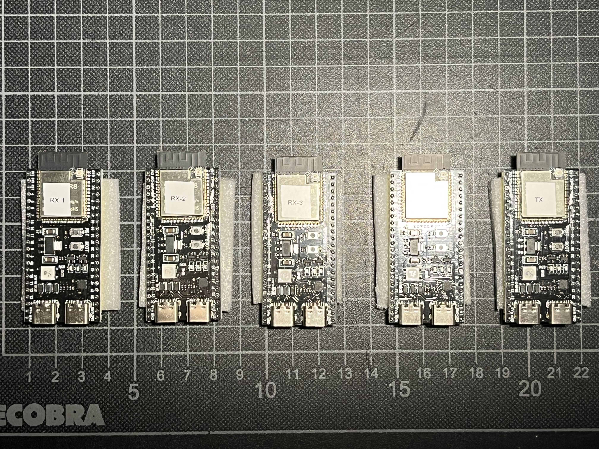
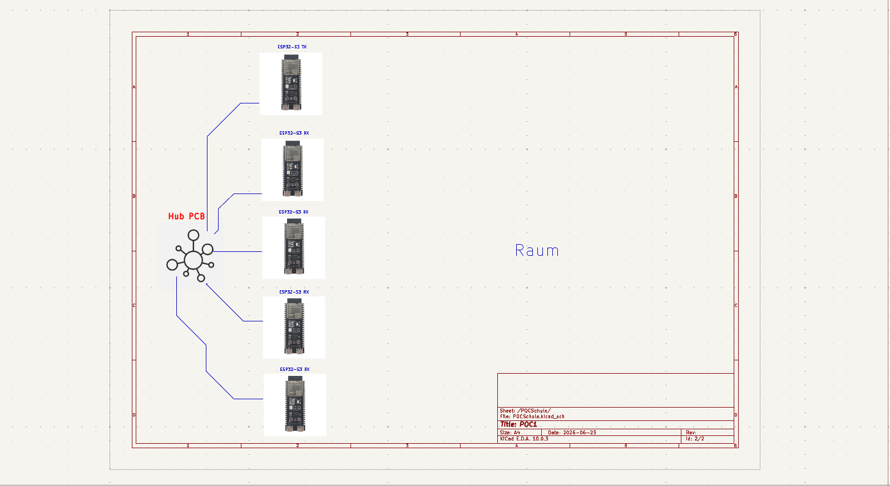
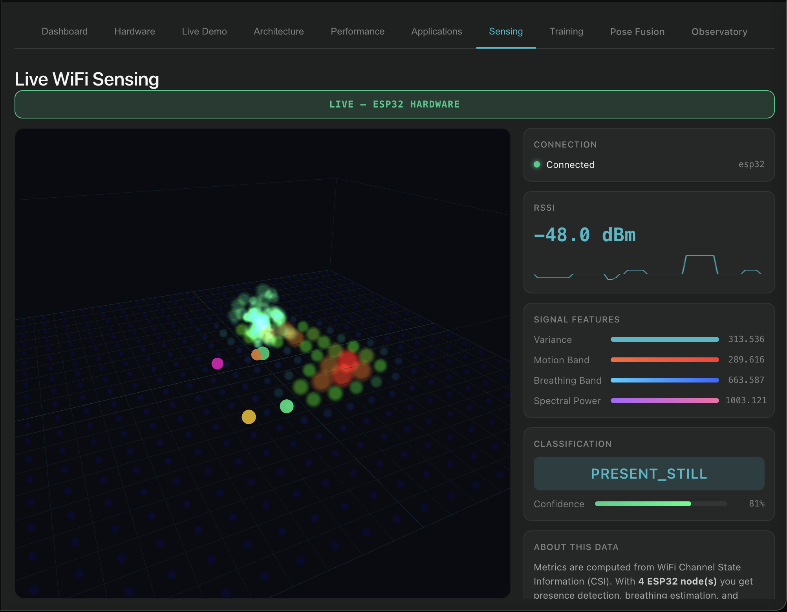

# WLAN-CSI-Projekt: Berichtsdokumentation


[](#)
[](#)

Stand: 2026-07-21

Letzte Ergänzung: 2026-07-27

## Problemfrage

Wie zuverlässig kann ein ESP32-basiertes WLAN-CSI-System Bewegungen und Atemrhythmen im Raum erfassen, und welche physikalischen Grenzen ergeben sich dabei?

## Zweck dieses Ordners

Dieser Ordner ist nicht als Schritt-für-Schritt-Anleitung gedacht. Er sammelt Material für den späteren Bericht:

- Ziele und Annahmen
- Versuchsprotokolle
- Erfolge, Fehlschläge und Änderungen
- Messbeobachtungen
- Auswertungsgrundlagen
- Material für Diskussion und Fazit

## Veröffentlichungsstand

Mit der Ergänzung vom 2026-07-27 werden zunächst die fortgeschriebene Dokumentation und die Ergebnisberichte veröffentlicht. Die neuen Rohmessdaten, der D5-Replayer mit seinen Tests sowie die zugehörigen lokalen RuView-/D5-Implementierungsänderungen bleiben vorerst lokal und werden zu einem späteren Zeitpunkt separat veröffentlicht.

Die Ergebnisberichte dokumentieren die verwendeten lokalen Datenpfade bereits vollständig. Solange die Rohdaten noch nicht veröffentlicht sind, dienen diese Pfade als Nachweis der lokalen Ablage und nicht als direkt auf GitHub verfügbare Dateien.

## Hardware-Aufbau

Fünf ESP32-S3-Boards bilden die Grundlage des Aufbaus: ein TX-Board sendet, vier RX-Boards (RX-1 bis RX-4) empfangen die CSI-Rohdaten.



## Referenzsensor: HLK-LD2450 24G mmWave

Als Referenzsensor für Präsenz- und Bewegungserkennung dient ein HLK-LD2450-Modul (24 GHz mmWave-Radar) mit Antenne und Anschlusskabel.


## Systemarchitektur (Skizze)

Geplante Erweiterung: eine zentrale Hub-PCB, an die TX- und alle RX-Boards angebunden werden, um die Verkabelung im Zielraum zu vereinfachen.



## Ordnerstruktur

```
wifi-csi-dokumentation/
├── README.md
├── 00-status-und-annahmen.md
├── 01-projektjournal.md
├── 02-versuchslog.md
├── 03-messprotokoll.md
├── 04-auswertung-bis-problemfrage.md
├── 05-erfolge-niederlagen-und-aenderungen.md
├── 06-ruview-anpassungen.md
├── 07-screenshot-nachweise.md
├── templates/
│   └── messblatt.md
├── data/
│   ├── raw/
│   └── processed/
├── logs/
├── results/
├── images/
│   ├── esp32-s3-boards.jpeg
│   ├── hlk-ld2450-mmwave-sensor.jpeg
│   └── hub-pcb-schema.png
└── skizzen/
    └── screenshots/
```

## Aktueller Versuchsstand

- Vorhanden: 5 ESP32-S3-Boards
- Vorhanden: 1 mmWave-Modul als Referenzsensor
- Aktueller WLAN-CSI-Aufbau: 1 ESP32-TX und 4 ESP32-RX
- RX1 bis RX4 liefern Raw-CSI-Daten an den lokalen RuView-Server
- Messreihen A0 bis A3, G1 und G2 liegen als Rohdaten/CSV vor
- Screenshot-Nachweise sind unter `07-screenshot-nachweise.md` nach Zeitstempel und Inhalt einsortiert
- Die RuView-Webvisualisierung ist aktuell nur qualitativ zu verwenden; sie springt ohne Kalibrierung/Geometrie stark
- Geplant: eine Hub-PCB zur zentralen Anbindung aller Boards (siehe Skizze oben)
- Der feste Raumaufbau vom 2026-07-18 ist vermessen und in RuView eingetragen; mmWave bleibt vorerst zurückgestellt
- Der Vergleich „still sitzen“ gegen „deutliche Bewegung“ zeigte überlappende Roh-Bewegungswerte. Die aktuelle Klassifikation ist deshalb noch kein gültiges Messergebnis
- Der Screenshot des fehlgeschlagenen Live-Tests und die technische Ursachenanalyse liegen unter `07-screenshot-nachweise.md` und `results/2026-07-18_fester-raum_live-visualisierung_diagnose.md`
- Der erste geplante D4-Leerraumtest mit TX-MAC-Filter liegt unter `results/2026-07-26_D4-E0_leerraum.md`, wurde aber nachträglich als Mischlauf markiert, weil der Raum währenddessen zweimal kurz betreten wurde
- Die gültige Wiederholung E0b liegt unter `results/2026-07-26_D4-E0b_sauberer-leerraum.md`: Der leere Raum wurde in 92,0 % der Samples fälschlich als `PRESENT_STILL` ausgegeben
- Der Mac-Positions-A/B-Test E0c liegt unter `results/2026-07-26_E0b-E0c_mac-position-ab-test.md`: Nach mittigem Aufstellen fiel RX4 von 84,8 % auf 0,0 % Fehlpräsenz
- Der Vergleich E0c/E1 liegt unter `results/2026-07-26_E0c-E1_still-person-separation.md`: RX4 trennt den aktuellen Leerraum und eine still sitzende Person deutlich
- Die unabhängige Wiederholung E0d/E1b liegt unter `results/2026-07-26_E0d-E1b_unabhaengige-bestaetigung.md`: Die RX4-Trennung wiederholte sich nicht; RX3 stieg dagegen in beiden Paaren
- Der D5-Offline-Replay liegt unter `results/2026-07-26_D5_offline-replay-und-experimentelle-praesenzkalibrierung.md`: per-RX-Leerraumreferenz und 2-RX-Quorum erreichen über beide vertauschten Laufpaare 0,0 % Fehlpräsenz und 89,3 % mittleren Still-Recall
- Der experimentelle D5-Serverpfad ist technisch für den kontrollierten Livetest freigegeben: 709 Rust-Tests, 7 Replayer-Tests, Release-Build und isolierter API-Lebenszyklus bestanden; eine erfolgreiche reale D5-Kalibrierung steht noch aus
- Nachtrag zum realen D5-Livetest: Die Kalibrierung wurde erfolgreich aktiv, aber die still sitzende Person wurde in 350 von 350 Samples als `ABSENT` ausgegeben. Die vollständige Auswertung liegt unter `results/2026-07-26_D5_realer-still-livetest.md`
- Softwarebasis RX/Server: [ruvnet/RuView](https://github.com/ruvnet/RuView)

## Was D5 konkret macht

D5 ist eine experimentelle zusätzliche Klassifikationsstufe. Sie soll ausschließlich unterscheiden, ob der Raum leer ist (`ABSENT`) oder ob eine weitgehend stillstehende Person anwesend ist (`PRESENT_STILL`). D5 erzeugt keine echte Raumortung und korrigiert die Heatmap beziehungsweise Punktwolke nicht automatisch.

### 1. Leerraumreferenz

Während einer 60-Sekunden-Kalibrierung werden für jeden RX sechs getrennte 10-Sekunden-Mittelwerte des `smoothed_motion_score` gebildet. Daraus berechnet D5 pro RX:

- den typischen Leerraumwert als Median
- die Streuung über MAD
- die robuste Skala `max(1,4826 × MAD; 0,005)`

Für diese Referenz werden ausschließlich Leerraumdaten und keine Personendaten verwendet.

### 2. Laufende Entscheidung

Nach erfolgreicher Kalibrierung betrachtet jeder RX immer die letzten zehn Sekunden. Der Mittelwert dieses Fensters wird mit der individuellen Leerraumreferenz verglichen. Ein RX stimmt für Anwesenheit, wenn seine Abweichung `z > 1` erreicht.

Ein einzelner auffälliger RX reicht nicht mehr aus. `PRESENT_STILL` wird nur ausgegeben, wenn:

- mindestens zwei RX gleichzeitig für Anwesenheit stimmen
- die Zustimmung zwei Sekunden bestehen bleibt
- mindestens drei RX gültige und aktuelle D5-Daten liefern

### 3. Sicherheitsregeln

- Es zählen nur CSI-Frames, die tatsächlich vom D5-Pfad akzeptiert wurden.
- Jeder nutzbare RX muss mindestens 5 Hz akzeptierte D5-Daten liefern.
- Eine Unterbrechung ab einer Sekunde verwirft das vollständige Livefenster.
- Nach einer Unterbrechung müssen erneut volle zehn Sekunden gesammelt werden.
- Evidenz- oder Nodeverlust löscht eine zuvor gesetzte Still-Präsenz.
- Ein Wechsel des Subcarrier-Rasters löscht die Referenz des betroffenen RX.
- Während der Kalibrierung kann D5 keine Still-Präsenz behaupten.

### 4. Zusammenspiel mit D4

D4 bleibt für deutliche Bewegung zuständig:

- `PRESENT_MOVING`
- `ACTIVE`

D5 übernimmt nach erfolgreicher Kalibrierung nur die schwierigere Entscheidung zwischen `ABSENT` und `PRESENT_STILL`. Vor der ersten erfolgreichen D5-Kalibrierung läuft weiterhin die bisherige D4-Logik; der Server meldet dann `legacy_d4`.

### 5. Bedienung und Diagnose

```text
POST /api/v1/classification/calibration/start
POST /api/v1/classification/calibration/stop
GET  /api/v1/classification/calibration/status
```

Der Status-Endpunkt zeigt pro RX unter anderem Referenz, aktuelles 10-Sekunden-Mittel, z-Wert, Stimme, akzeptierte Datenrate, Frische und Verwendbarkeit.

Der Offline-Replay der bestehenden Laufpaare erreichte 0,0 % Leerraum-Fehlpräsenz, 89,3 % mittleren Still-Recall und 94,7 % Balanced Accuracy. Das ist wegen nur zwei Laufpaaren, einer Sitzung und einer Sitzposition noch kein Produktionsnachweis. Vor einer Standardaktivierung folgen eine neue reale Leerraumkalibrierung, ein blinder Leerraumlauf, ein blinder Still-Lauf und mindestens eine weitere Sitzposition.

Ausführliche Auswertung: [D5: Offline-Replay und experimentelle Präsenzkalibrierung](results/2026-07-26_D5_offline-replay-und-experimentelle-praesenzkalibrierung.md)

### 6. Ergebnis des ersten realen D5-Livetests

Nach dem Offline-Replay wurde D5 real im leeren Raum kalibriert. Die vier RX-Referenzen und die laufende Evidenz waren im anschließenden Positivtest verfügbar. Trotzdem blieb die globale Ausgabe während 350 Samples beziehungsweise rund 89,7 Sekunden vollständig `ABSENT`.

Im ersten Abschnitt stimmte zeitweise nur RX4 für Präsenz. Im zweiten Abschnitt stimmte RX3 durchgehend, aber kein zweiter RX ausreichend lange. Die Zwei-RX-Regel verhinderte dadurch zwar Einzel-RX-Auslösungen, übersah aber die tatsächlich anwesende Person vollständig.

Dieser Livetest ist nicht bestanden. D5 bleibt experimentell und wird nicht als Standard aktiviert. Als nächster Entscheidungstest wird eine zusammengehörige blinde Serie aus Leerraum und mehreren Still-Positionen unter derselben Kalibrierung benötigt.

Ausführliche Auswertung: [D5: realer Still-Livetest nach Leerraumkalibrierung](results/2026-07-26_D5_realer-still-livetest.md)

## Wichtige aktuelle Befunde

- Die 4RX-Datenerfassung funktioniert stabil genug für erste Auswertungen.
- Ein Guard-Intervall von 500 ms reduziert Fusion-Fallbacks deutlich, ist aber nur ein Visualisierungs-Workaround.
- Leerer Raum wird aktuell teilweise fälschlich als `presence=True` klassifiziert.
- Atem-/Herzfrequenzwerte sind ohne Referenzsensor noch nicht belastbar.
- Für eine echte Positionsanzeige wären Geometrie, Kalibrierung und bessere Synchronisation nötig.
- Feste Geometrie und eine leere-Raum-Kalibrierung allein haben die Trennung von Stillstand und Bewegung nicht gelöst.
- Vor weiteren Klassifikationstests muss geprüft werden, ob jeder RX ausschließlich vergleichbare CSI-Pakete des vorgesehenen TX verarbeitet.
- Alle vier RX filtern inzwischen auf die MAC-Adresse des kontrollierten TX.
- E0b bestätigt: D4 beseitigt die globalen groben Bewegungsalarme, aber noch nicht die Still-Präsenz-Fehlalarme.
- RX4 meldete im leeren Raum in 84,4 % der Samples lokale Präsenz; durch die globale ODER-Logik führte das zusammen mit RX2/RX3 zu 92,0 % globaler Fehlpräsenz.
- Das mittige Aufstellen des Macs beseitigte die RX4-Fehlpräsenz und senkte die globale Fehlpräsenz auf 46,8 %. RX2 und RX3 blieben nahezu unverändert.
- Der Mac-Standort und seine Kabel sind damit Teil des festzuhaltenden Versuchsaufbaus.
- Die starke RX4-Reaktion des ersten Still-Laufs war nicht reproduzierbar; eine feste RX4-Schwelle von 0,01 wird deshalb verworfen.
- RX3 zeigte in beiden unabhängigen Paaren einen höheren Minutenmittelwert bei stiller Person als im jeweils vorherigen Leerraum.
- D5 setzt diese Richtung als experimentellen Prototyp um: per-RX-Leerraumreferenzen, 10-Sekunden-Fenster, zwei absolute RX-Stimmen und separate Aktivierungskalibrierung.
- Das positive D5-Replay ist wegen nur zwei Laufpaaren, einer Sitzung und einer Sitzposition noch kein Produktionsnachweis. Die nächsten Läufe müssen mit eingefrorenen Parametern blind geprüft werden.
- Der erste reale D5-Positivtest erreichte 0,0 % Still-Recall: Erst reagierte nur RX4, danach nur RX3. Das Zwei-RX-Quorum wurde nie erfüllt.
- D5 bleibt deshalb deaktiviert. Eine Lockerung des Quorums ist ohne zugehörigen neuen Leerraumlauf nicht vertretbar.

## Screenshot des fehlgeschlagenen RuView-Livetests

[](results/2026-07-18_fester-raum_live-visualisierung_diagnose.md)

Der Screenshot zeigt den laufenden festen 1TX-/4RX-Aufbau. Obwohl RuView `PRESENT_STILL` mit `81 %` anzeigte, waren zwei Marker optisch fast überlagert, die Punktwolke reagierte nicht nachvollziehbar auf Bewegung und bewegte sich später auch beim stillen Sitzen. Das Bild ist daher ein Fehlernachweis und kein Beleg für eine korrekte Positionsbestimmung. Ein Klick auf das Bild öffnet die vollständige Diagnose.

## Dokumentationsregel

Jede relevante Beobachtung wird dokumentiert, auch wenn sie negativ ist. Gerade Fehlversuche sind wichtig, weil sie später die physikalischen und technischen Grenzen erklären.

Konkrete Arbeitsanleitungen gehören nicht in diesen Ordner, sondern werden separat im Chat oder in Arbeitsnotizen geführt.
