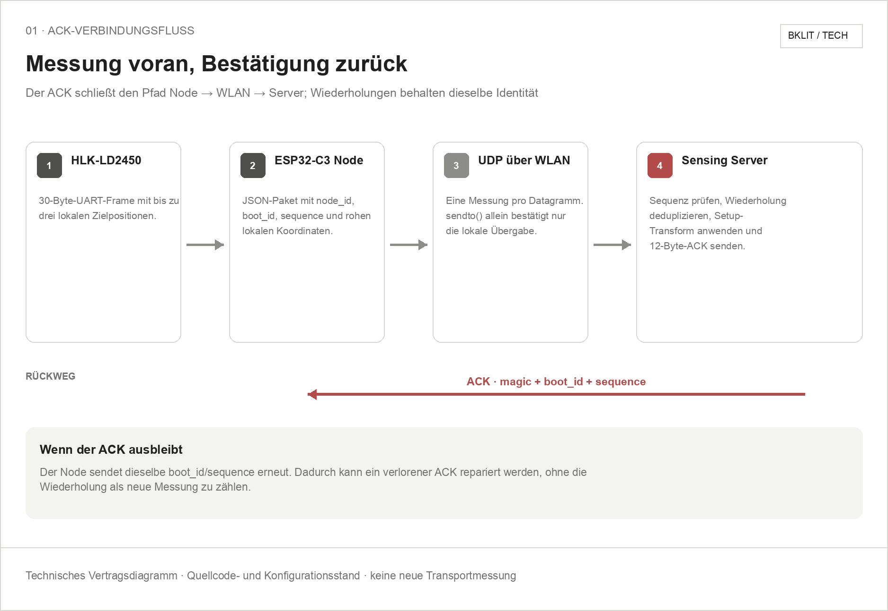

# Wie Observatory funktioniert

[English](architecture.en.md)

WLAN-Signale verändern sich durch Reflexion, Abschattung und Multipath. Ein
TX-Board erzeugt den kontrollierten Funkverkehr; RX1 bis RX4 messen die
komplexen CSI-Werte aus verschiedenen Raumpositionen. Observatory vergleicht
diese Messungen mit einer aufbaugebundenen Leerraumreferenz.

Die Positionsbestimmung ist absichtlich diskret. Statt zwischen ungemessenen
Koordinaten zu interpolieren, lernt D6 Fingerprints für neun markierte
Bodenpunkte. Reicht die Evidenz nicht aus oder passen mehrere Punkte ähnlich
gut, muss das System `unknown` oder `ambiguous` ausgeben.

Der mmWave-Sensor dient nur als unabhängige Referenz für Kalibrierung und
Blindbewertung. Dadurch wird verhindert, dass der WLAN-CSI-Prädiktor während
des Tests indirekt die richtige Antwort erhält.

## Aktuelle mmWave-Verbindung

Der mmWave-Node sendet jede Radarmessung mit `node_id`, `boot_id`, `sequence`
und lokalen Rohkoordinaten per UDP. Der Server bestätigt die konkrete
`boot_id`/`sequence` mit einem kompakten ACK. Bleibt dieser aus, wiederholt der
Node dieselbe Messungsidentität; der Server kann das Paket dadurch sicher
deduplizieren. Der ACK-Timeout startet bei 150 ms, passt sich an beobachtete
Roundtrips an und bleibt auf 2000 ms begrenzt.

Die Raumtransformation wird nicht mehr als aktuelle Wahrheit auf dem Node
gepflegt. Der Server wendet den zur `node_id` passenden, versiegelten
Setup-v2-Transform auf die Rohkoordinaten an. Bereits transformierte
Paketfelder bleiben nur für ältere Empfänger und Standalone-Diagnostik
erhalten.

Die folgenden Bklit-artigen Schaubilder dokumentieren diese implementierten
Verträge. Sie enthalten bewusst keine neuen Messwerte und belegen weder
Paketverlustfreiheit noch Positionsgenauigkeit.




```text
physischer Aufbau
→ Setup-Siegel
→ 25-s-Preflight
→ 65-s-Leerraumkalibrierung
→ P01–P09-Training
→ Positionsindex
→ Blindtests
→ gemeinsame Qualitätsgates
→ Live-Anzeige
```

Die Implementierungsdetails stehen im [Software-Überblick](software/README.md);
die reproduzierbaren UI-Schritte sind im
[Experiment-Cockpit-Guide](software/experiment-cockpit.md) beschrieben.
