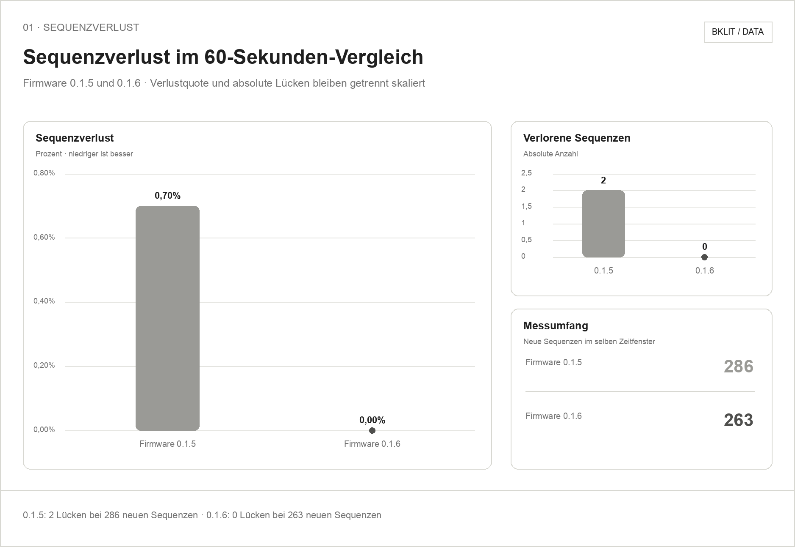
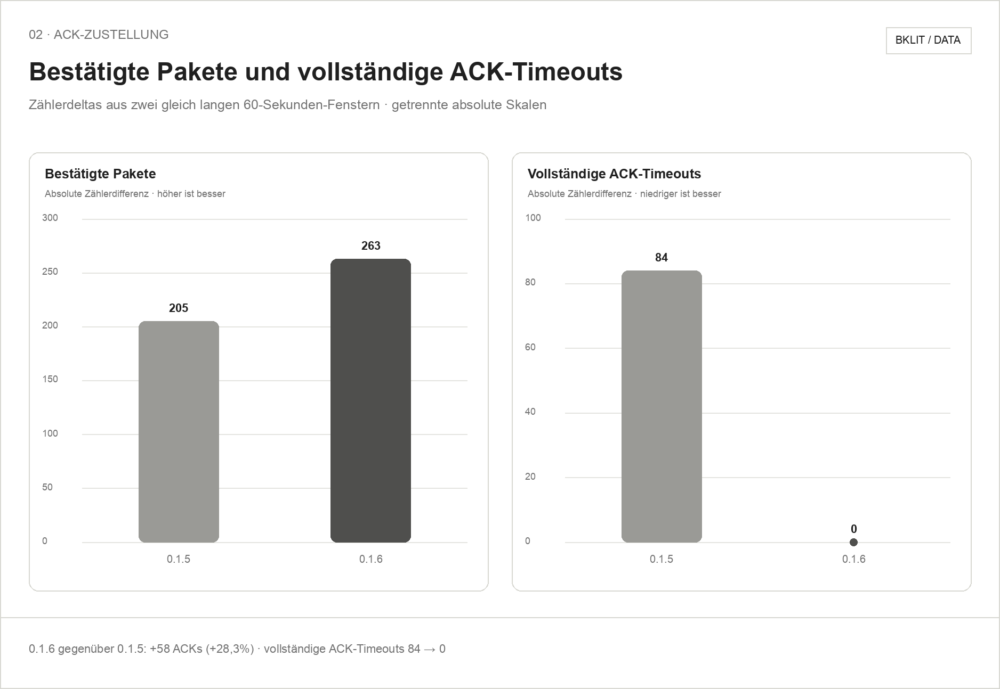
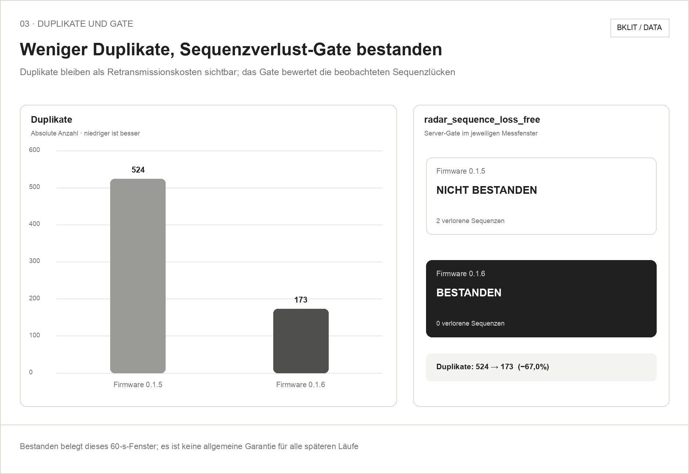

# mmWave-Sequenzverlust: Firmware 0.1.5 gegen 0.1.6

Datum: 20. September 2026  
Umfang: zwei 60-Sekunden-Messfenster des mmWave-Transports

## Ergebnis

Firmware `0.1.6` hatte im bereitgestellten 60-Sekunden-Lauf **keine verlorene
Sequenz**. Die gemessene Sequenzverlustquote sank von `0,70 %` bei Firmware
`0.1.5` auf `0,00 %`; gleichzeitig sank die Zahl vollständiger ACK-Timeouts
von `84` auf `0`. Das Server-Gate `radar_sequence_loss_free` wechselte damit
von **nicht bestanden** zu **bestanden**.

## Messwerte

| Messwert | Firmware 0.1.5 | Firmware 0.1.6 |
|---|---:|---:|
| Messdauer | 60 s | 60 s |
| Neue Sequenzen | 286 | 263 |
| Verlorene Sequenzen | 2 | **0** |
| Sequenzverlust | 0,70 % | **0,00 %** |
| Vollständige ACK-Timeouts | +84 | **+0** |
| Bestätigte Pakete | +205 | **+263** |
| Duplikate | +524 | +173 |
| `radar_sequence_loss_free` | nicht bestanden | **bestanden** |

Die maschinenlesbare Abschrift steht in [`data/vergleich.csv`](data/vergleich.csv).
Die bereitgestellte Quote entspricht `verlorene Sequenzen / neue Sequenzen`:
`2 / 286 = 0,699 %`, gerundet `0,70 %`; bei `0 / 263` ergibt sich `0,00 %`.

## Abgeleitete Änderungen

- Sequenzverlust: `−0,70` Prozentpunkte, im beobachteten Fenster auf null.
- Vollständige ACK-Timeouts: `−84` beziehungsweise `−100 %`.
- Bestätigte Pakete: `+58` beziehungsweise `+28,3 %`.
- Duplikate: `−351` beziehungsweise `−67,0 %`.
- Neue Sequenzen: `−23` beziehungsweise `−8,0 %`; beide Läufe dauerten 60 s.

## Interpretation

Der Lauf mit Firmware `0.1.6` **bestand den Sequenzverlust-Preflight**. Das ist
ein klarer Fortschritt gegenüber `0.1.5`, aber noch keine allgemeine Aussage,
dass jeder spätere Lauf verlustfrei bleibt. Dafür sind wiederholte, gleich
aufgebaute Messfenster erforderlich.

Die ACK-, Timeout- und Duplikatwerte sind Zählerdifferenzen aus dem jeweiligen
60-Sekunden-Fenster. Sie werden nicht zu einer künstlichen Bilanz addiert:
Zählergrenzen, bereits laufende Zustellungen und Retransmissionen können die
Summen unterschiedlich abgrenzen. Duplikate werden deshalb als verbleibende
Transportkosten ausgewiesen, nicht als neue Messungen.

Der bestandene Transporttest belegt weder Erkennungs- noch
Positionsgenauigkeit. Der mmWave-Sensor bleibt ausschließlich unabhängige
Referenz beziehungsweise Ground Truth.

## Evidenzgrenze

Quelle dieses Pakets ist die für beide Firmwarestände bereitgestellte
Vergleichstabelle. Roh-Snapshots, genaue Startzeitpunkte und wiederholte Läufe
sind in diesem Paket nicht enthalten. Die Diagramme visualisieren daher exakt
die zwei angegebenen Messfenster und erheben keinen darüber hinausgehenden
Statistikanspruch.

Renderzuordnung und Sichtprüfung sind in [`rendering.md`](rendering.md)
dokumentiert.
