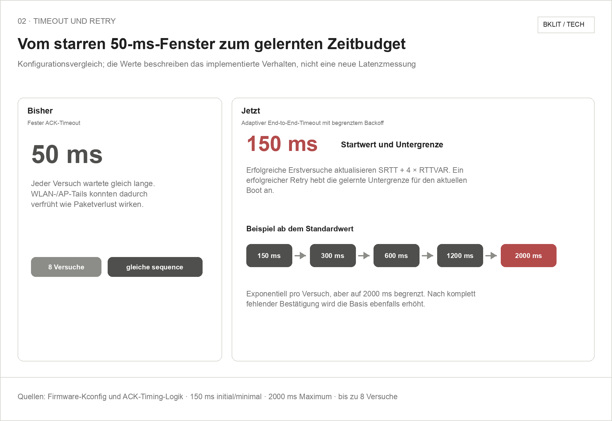
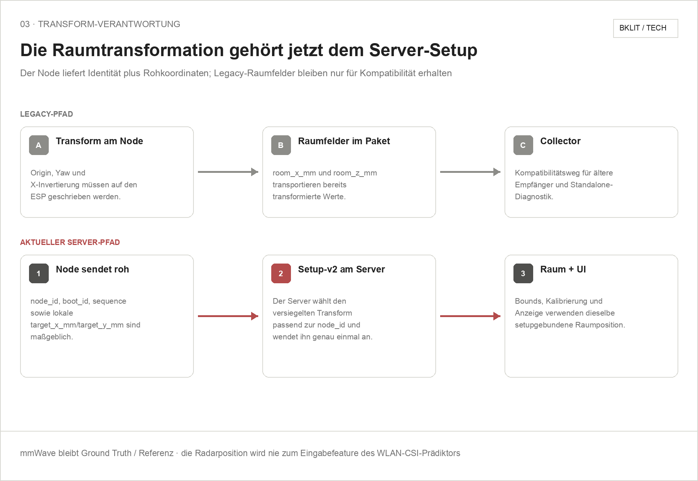

# How Observatory works

[Deutsch](architecture.md)

WiFi signals change through reflection, attenuation, and multipath. One TX
board generates controlled radio traffic; RX1 through RX4 measure complex CSI
values from different positions in the room. Observatory compares these
measurements with an empty-room reference bound to the same setup.

Positioning is deliberately discrete. Instead of interpolating between
unmeasured coordinates, D6 learns fingerprints for nine marked floor points.
If the evidence is insufficient or multiple points match similarly well, the
system must return `unknown` or `ambiguous`.

The mmWave sensor is used only as an independent calibration and blind-test
reference. This prevents the WiFi CSI predictor from indirectly receiving the
correct answer during evaluation.

## Current mmWave connection

The mmWave node sends each radar observation over UDP with its `node_id`,
`boot_id`, `sequence`, and raw local coordinates. The server acknowledges the
specific `boot_id`/`sequence` with a compact ACK. If that ACK is missing, the
node retries the same measurement identity, allowing the server to deduplicate
the packet safely. The ACK timeout starts at 150 ms, adapts to observed round
trips, and is capped at 2000 ms.

The node is no longer the current source of truth for the room transform. The
server applies the sealed Setup-v2 transform matching the `node_id` to the raw
coordinates. Already transformed packet fields remain only for older
collectors and standalone diagnostics.

The following Bklit-style diagrams document those implemented contracts. They
deliberately contain no new measurements and prove neither loss-free transport
nor positioning accuracy.






```text
physical setup
→ setup seal
→ 25-second preflight
→ 65-second empty-room calibration
→ P01–P09 training
→ position index
→ blind tests
→ joint quality gates
→ live display
```

Implementation details are in the [software overview](../../software/README.md); the
reproducible UI steps are documented in the
[experiment cockpit guide](../../software/experiment-cockpit.en.md).
