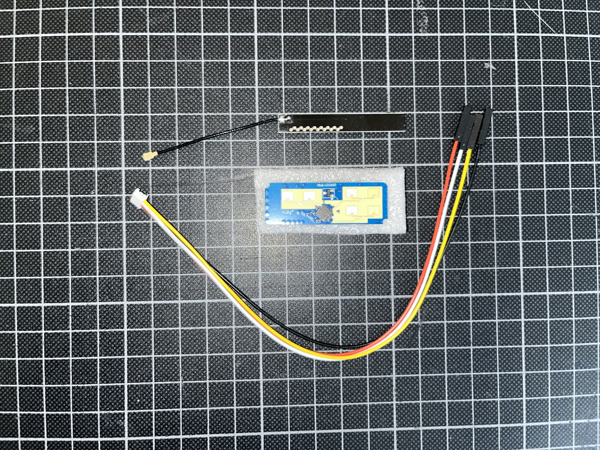
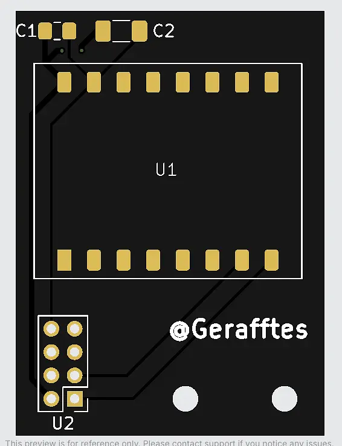
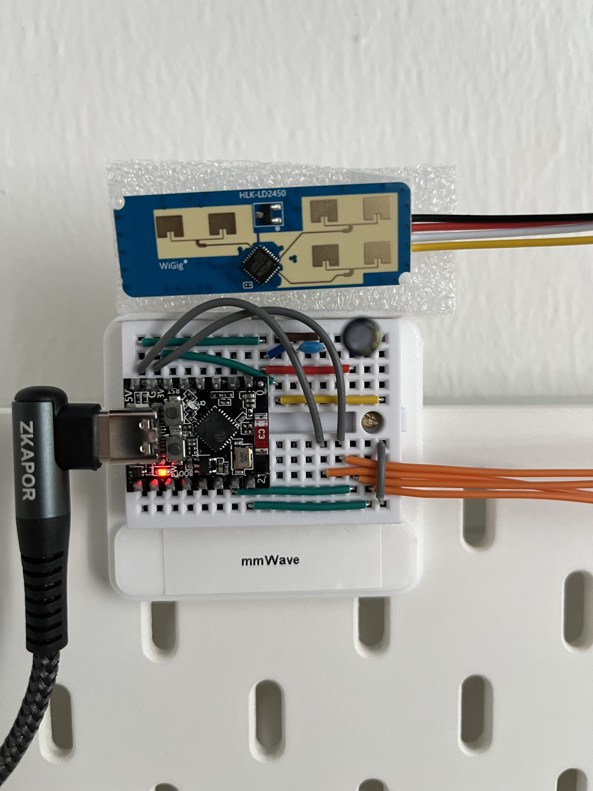

# Hardware

[Deutsch](README.md)

The WiFi CSI setup consists of five ESP32-S3 boards. A separate ESP32-C3 board
connects the HLK-LD2450 as an independent mmWave reference sensor.

## Reference sensor

## PCBs

PCB-01 connects the ESP32-C3 to the mmWave reference path. The following
manufacturing preview documents the earlier board revision:

The [PCB-01 Gerber and drill files](pcb-01/) are available with a SHA-256
checksum and manufacturing note.

The final [PCB-03 with KiCad sources, validation reports, and ordering archive](pcb-03/)
applies the corrected 180° LD2450 orientation, keeps the SMD capacitors, and
preserves the PCB-01/PCB-02 outer dimensions and mounting-hole positions.

PCB-02 remains documented as the previous revision. The canonical
[PCB-02 design sources](mmwave-PCB/PCB-02/) contain the KiCad, Gerber, and
STEP files; the separate [PCB-02 manufacturing archive](pcb-02/) preserves
the ordering, validation, and preview artifacts for that revision.

> [!IMPORTANT]
> **PCB-03 is the required revision for the current setup.** PCB-01 and PCB-02 remain documented as previous revisions.

## Breadboard setup

The comparison below shows the current PCB-03 revision next to the temporary
breadboard setup:

<table>
<tr>
<td> <strong>PCB-03 — current revision</strong> This final board is the one to use for the current mmWave setup.</td>
<td> <strong>Temporary breadboard setup</strong> The photo documents the provisional mmWave wiring on the breadboard.</td>
</tr>
</table>

All files and sourcing references are collected on the separate
[breadboard page](breadboard/README.en.md): STL, setup photo, heat-set insert,
installation tip, wood screws, and both mmWave capacitors.

The page also documents the used quantities and the still-open validation items
for printing, insertion temperature, and fit.

## ESP32-S3 enclosure

The external MakerWorld model
[*ESP32 S3 Wroom Case*](https://makerworld.com/de/models/1456361-esp32-s3-wroom-case#profileId-1517915)
by MakerWorld user [`aiekick`](https://makerworld.com/de/@aiekick) is intended as
an enclosure for the ESP32-S3 boards.

The source page lists the model under the **MakerWorld Standard Digital File
License**, so the STL is not redistributed in this repository. See
[`esp32-s3-case/`](esp32-s3-case/) for the usage note.
