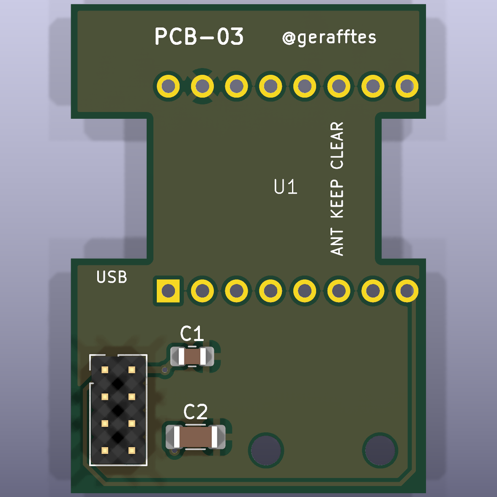

# Hardware

[English](README.en.md)

Der WLAN-CSI-Aufbau besteht aus fünf ESP32-S3-Boards. Ein separates
ESP32-C3-Board bindet den HLK-LD2450 als unabhängigen mmWave-Referenzsensor an.

## Referenzsensor

## Platinen

PCB-01 verbindet den ESP32-C3 mit dem mmWave-Referenzpfad. Die folgende
Fertigungsvorschau dokumentiert den früheren Platinenstand:

Die [Gerber- und Bohrdaten von PCB-01](pcb-01/) liegen mit SHA-256 und
Fertigungshinweis im Repository.

Die finale [PCB-03 mit KiCad-Quellen, Prüfberichten und Bestellarchiv](pcb-03/)
übernimmt die korrigierte 180°-Ausrichtung des LD2450, verwendet weiterhin
SMD-Kondensatoren und behält dieselben Außenmaße sowie Montagebohrungen wie
PCB-01/PCB-02.

PCB-02 bleibt als vorherige Revision dokumentiert. Die kanonischen
[PCB-02-Designquellen](mmwave-PCB/PCB-02/) enthalten KiCad-, Gerber- und
STEP-Dateien; das separate [PCB-02-Fertigungsarchiv](pcb-02/) bewahrt die
Bestell-, Prüf- und Vorschaudateien dieser Revision.

> [!IMPORTANT]
> Für den aktuellen Aufbau ist ausdrücklich **PCB-03** zu verwenden. PCB-01 und PCB-02 bleiben als frühere Revisionen dokumentiert.

## Breadboard-Aufbau

Die folgende Gegenüberstellung zeigt die aktuelle PCB-03-Revision neben dem
vorläufigen Breadboard-Aufbau:

<table>
<tr>
<td> <strong>PCB-03 — aktuelle Revision</strong> Diese finale Platine ist für den aktuellen mmWave-Aufbau zu verwenden.</td>
<td> <strong>Vorläufiger Breadboard-Aufbau</strong> Das Foto dokumentiert den provisorischen mmWave-Aufbau auf dem Breadboard.</td>
</tr>
</table>

Alle Dateien und Bezugsangaben stehen auf der separaten
[Breadboard-Seite](breadboard/README.md): STL, Montagefoto, Heat-Set-Insert,
Installation Tip, Holzschrauben und die beiden mmWave-Kondensatoren.

Die Seite dokumentiert außerdem die verwendeten Mengen und die noch offenen
Validierungen zu Druck, Einpress-Temperatur und Passprobe.

## ESP32-S3-Gehäuse

Als Gehäuse für die ESP32-S3-Boards ist das externe MakerWorld-Modell
[*ESP32 S3 Wroom Case*](https://makerworld.com/de/models/1456361-esp32-s3-wroom-case#profileId-1517915)
von MakerWorld-Nutzer [`aiekick`](https://makerworld.com/de/@aiekick) vorgesehen.

Das Modell steht laut Quellseite unter der **MakerWorld Standard Digital File
License**. Die STL wird deshalb nicht erneut in diesem Repository bereitgestellt.
Weitere Hinweise stehen unter [`esp32-s3-case/`](esp32-s3-case/).
