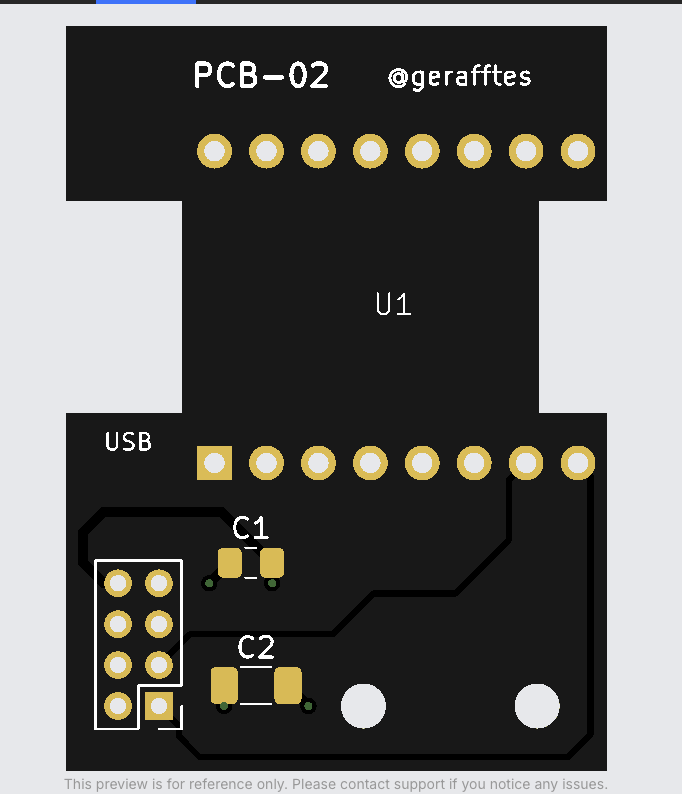

# PCB-02 – ESP32-C3 SuperMini / LD2450 carrier

This is a revised, separate copy of `PCB-01`. The original project was not modified.

## Changes from PCB-01

- Replaced the hidden castellated contact pads with two 2.54 mm through-hole rows for pin headers or sockets.
- Added a left-side USB-C opening and a right-side board cutout below the ESP antenna.
- Kept the PCB-01 outer envelope (26.45 x 36.42 mm) and both 2.20 mm mounting-hole positions unchanged for case compatibility.
- Placed the `PCB-02` and `@gerafftes` identification together along the top edge on F.Silkscreen.
- Kept copper and UART routing out of the antenna cutout.
- Kept C1 and C2 as hand-solderable SMD parts and moved them close to the LD2450 connector.
- Widened the 5 V and GND routing after the ESP header transition.
- Routed every copper corner with a 45-degree transition; there are no 90-degree track bends.
- Preserved the required UART mapping:
  - LD2450 TX -> ESP GPIO20 / RX
  - ESP GPIO21 / TX -> LD2450 RX

## Assembly

| Reference | Part | Important detail |
| --- | --- | --- |
| U1 | ESP32-C3 SuperMini HW-466AB | 2 x 8 pins, 2.54 mm pitch, 15.24 mm row spacing; 1.70 mm pads with 1.00 mm drills for headers or sockets |
| U2 | HLK-LD2450 connector | 2 x 4 pins, 2.00 mm pitch |
| C1 | 100 nF ceramic capacitor | SMD 0805, non-polarized, hand-solder footprint |
| C2 | 10 uF bulk capacitor | SMD 1206, non-polarized, hand-solder footprint |

The right side marked `ANT KEEP CLEAR` must remain free. Do not add copper, wires, metal spacers, or an enclosure wall directly below or in front of the ESP antenna.

Before ordering, compare the physical ESP module against these verified footprint assumptions: 18.00 x 22.52 mm body, 2.54 mm pin pitch, 15.24 mm row spacing, USB end beside 5V/GND, and antenna end beside GPIO20/GPIO21. Third-party SuperMini clones can differ.

The mounting holes match PCB-01 at (163.50, 89.00) mm and (172.00, 89.00) mm. PCB-02 has the same outer width and height as PCB-01, but the case still needs openings around the new USB and antenna cutouts.

## Validation

- KiCad ERC: 0 violations.
- KiCad DRC including schematic parity: 0 violations, 0 unconnected items, 0 footprint errors.
- Copper angle audit: all segments are horizontal, vertical, or 45 degrees; no 90-degree track bends.
- [PCB-02 Gerber and Excellon ordering archive](PCB-02-order-ready.zip)
- [Connection audit](validation/PCB-02-connection-audit.txt)
- [Geometry audit](validation/PCB-02-geometry-audit.txt)
- [DRC report](validation/PCB-02-DRC.rpt) · [ERC report](validation/PCB-02-ERC.rpt)

Preview:

Reference preview with the final `PCB-02` and `@gerafftes` silkscreen:

The KiCad source files in this folder are included so the revision can be inspected or edited.

These checks validate the PCB files and connectivity. They do not prove that the existing ESP or LD2450 hardware is functional.
