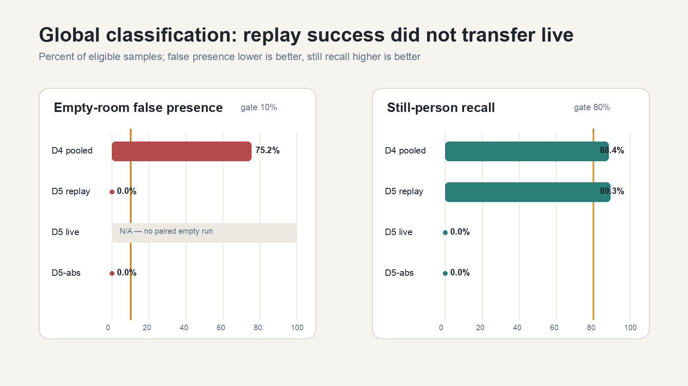
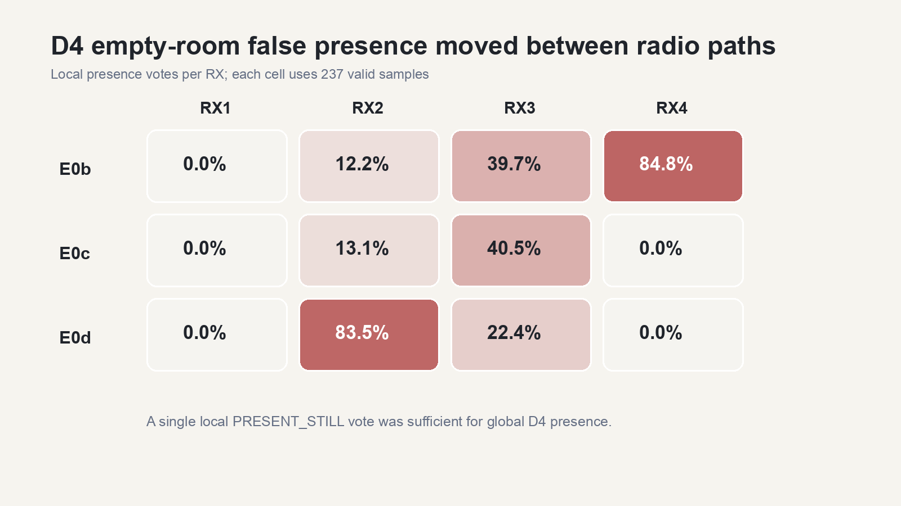
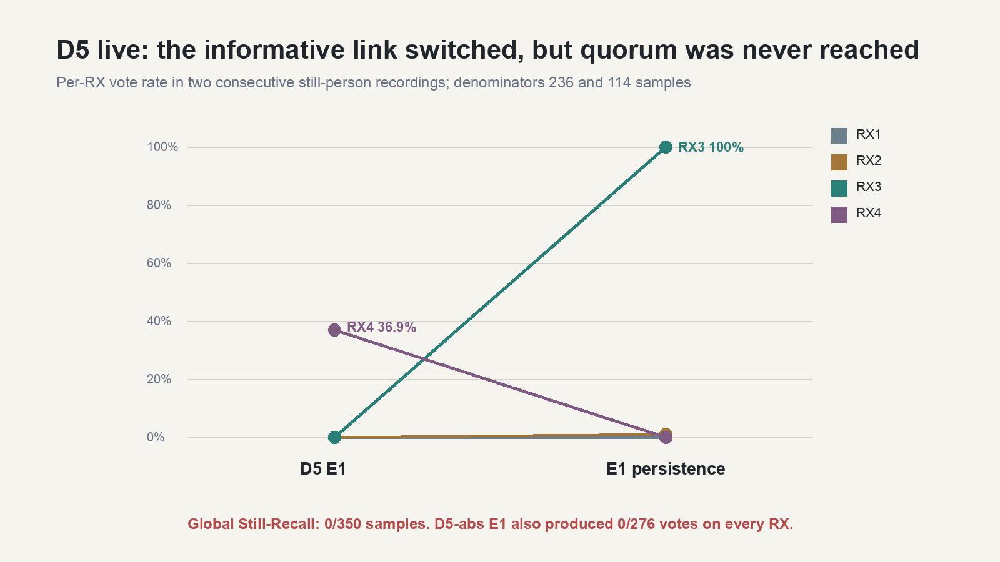
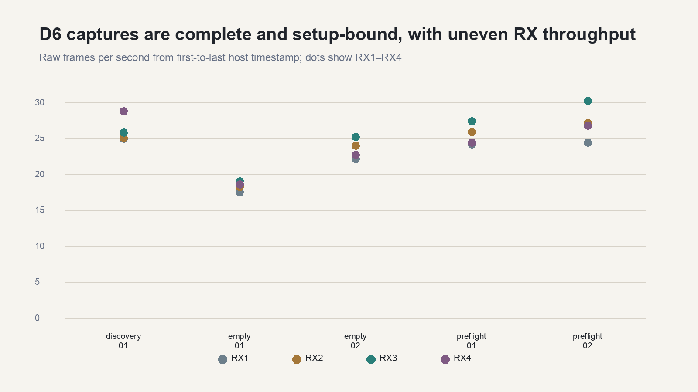

# D4/D5/D6 — technischer Ergebnisbericht

Stand: 23. August 2026
Auswertung: vorhandene Aufnahmen, keine neue Messung, keine Schwellenwertänderung

## Technische Zusammenfassung

- **D4 begrenzt grobe Bewegungsalarme, löst Anwesenheit aber nicht.** In den drei gültigen Leerraumläufen E0b/E0c/E0d waren 535 von 711 Samples global positiv: **75,2 % Fehlpräsenz**. `PRESENT_MOVING` und `ACTIVE` verschwanden weitgehend, aber ein einzelner lokaler `PRESENT_STILL`-Pfad genügte weiterhin für globale Präsenz.
- **Das historische D5-Offline-Replay bestand, der reale Transfer nicht.** Zwei vertauschte Replay-Folds erreichten im Mittel 0,0 % Leerraum-Fehlpräsenz und 89,3 % Still-Recall. Der anschließende reale Still-Livetest erreichte dagegen 0 von 350 global positiven Samples: **0 % Recall**.
- **D5-abs senkt die Leerraum-Fehlpräsenz, macht den Still-Recall aber unbrauchbar.** E0 Validation bestand mit 0/273 globalen Fehlpräsenzen; E1 verfehlte mit 0/276 den Recall vollständig. Gegen die Zielgrenzen ist D5-abs insgesamt **nicht bestanden**.
- **D6 belegt technisch vollständige, setupgebundene Roh-CSI-Erfassung.** Alle fünf Aufnahmen sind `completed`, nicht unvollständig, haben 0 Recorder-Drops, keinen Writerfehler, RX1–RX4 und ein einheitliches Raster von 2.437 MHz / 1 Antenne / 64 Subcarriern. `empty-neutral-02` ist die beste Baseline-Kandidatin der aktuellen Setup-Serie.
- **Keine Phase beweist zuverlässige Live-Positions- oder Personenerkennung.** D6 enthält keine Ground Truth; D4/D5 wurden nicht gegen einen unabhängigen mmWave-Pfad blind validiert. mmWave bleibt für Kalibrierung, Ground Truth, Synchronisation und Blindtests erforderlich.

## Umfang und Nenner

Der [bereinigte Laufüberblick](2026-08-23_D4-D5-D6_laufuebersicht.csv) inventarisiert **25 Aufnahmen**: 20 API-/Klassifikationsläufe und 5 D6-Roh-CSI-Aufnahmen. Der [D4-RX-Diagnostikexport](2026-08-23_D4_RX_diagnostik.csv) enthält zusätzlich pro Lauf und RX die Stimmen sowie Mittelwert und P95 der rohen und geglätteten Bewegungsscores.

| Datengruppe | Läufe | Zulässige Verwendung |
|---|---|---|
| A0–A3, G1/G2 vom 28.06. | 7 | historische technische Inventur; keine direkte Prozentwert-Gegenüberstellung wegen 1-s-Samplerate und anderer Guard-/Aufbaubedingungen |
| Vor-D4 vom 26.07. | A0, A1 | historische Referenz; kein direkter D4/D5-Vergleich |
| D4 | kontaminiertes E0 plus E0b/E0c/E0d/E1/E1b | E0 ausgeschlossen; drei saubere Leerraum- und zwei Personenläufe für den direkten D4-Nenner |
| D5 Replay | E0c/E1 und E0d/E1b | historische Offline-Evidenz nach vollständigem 10-s-Fenster; kein Live-Nachweis |
| D5 live | E1, E1 Persistenz | reale Still-Person-Evidenz; kein gepaarter Leerraumlauf derselben Kalibrierung |
| D5-abs | E0 Calibration, E0 Validation, E1 | Kalibrierung getrennt von blindem Leerraum und Still-Person-Lauf |
| D6 | Discovery, Preflight 01/02, Empty 01/02 | Rohdaten-/Recorder-/Setup-Evidenz; keine Klassifikationsgenauigkeit |

Für D4, D5 live und D5-abs ist der Nenner die Zahl gespeicherter, technisch gültiger API-Samples. Die Speicherrate ist `Samples / Zeitspanne zwischen erstem und letztem Sample`. Für das D5-Replay beginnt der Nenner erst nach dem vollständigen kausalen 10-s-Fenster: je Fold 197 Leerraum- und 197 Personensamples. Für D6 ist der Nenner die Zahl der Rohframes; die Rate ist `Frames / Zeitspanne zwischen erstem und letztem Host-Zeitstempel`.

`dropped_frames = 0` bedeutet bei D6: Der Recorder hat keine bereits angenommenen Frames beim Schreiben verworfen. Es beweist nicht, dass über Funk jedes theoretisch erwartete Frame angekommen ist.

## D4: globale Klassifikation und RX-Ursache

Das kontaminierte E0 wird nicht als Leerraum-Baseline verwendet. Der direkte Vergleich enthält nur E0b/E0c/E0d und E1/E1b.

| Lauf | Zustand | gültige Samples | Dauer | Samples/s | global positiv | Anteil |
|---|---|---:|---:|---:|---:|---:|
| E0b | leer | 237 | 59,850 s | 3,9599 | 218 | 92,0 % |
| E0c | leer | 237 | 59,973 s | 3,9518 | 111 | 46,8 % |
| E0d | leer | 237 | 59,961 s | 3,9526 | 206 | 86,9 % |
| **Leerraum gepoolt** | **leer** | **711** | **179,784 s** | **3,9548** | **535** | **75,2 % Fehlpräsenz** |
| E1 | Person still | 237 | 59,937 s | 3,9542 | 189 | 79,7 % |
| E1b | Person still | 237 | 59,983 s | 3,9511 | 230 | 97,0 % |
| **Person gepoolt** | **Person still** | **474** | **119,920 s** | **3,9526** | **419** | **88,4 % Recall** |

Alle fünf verwendeten Läufe enthalten die vier Pflichtdateien, RX1–RX4 in jedem Sample, keine `stale`-Zustände, keine ungültigen Sync-Markierungen und leere `errors.log`-Dateien.

### Stimmen pro RX

| Zustand | RX1 | RX2 | RX3 | RX4 |
|---|---:|---:|---:|---:|
| Leerraum E0b | 0/237 (0,0 %) | 29/237 (12,2 %) | 94/237 (39,7 %) | 201/237 (84,8 %) |
| Leerraum E0c | 0/237 (0,0 %) | 31/237 (13,1 %) | 96/237 (40,5 %) | 0/237 (0,0 %) |
| Leerraum E0d | 0/237 (0,0 %) | 198/237 (83,5 %) | 53/237 (22,4 %) | 0/237 (0,0 %) |
| **Leerraum gepoolt** | **0/711 (0,0 %)** | **258/711 (36,3 %)** | **243/711 (34,2 %)** | **201/711 (28,3 %)** |
| Person E1 | 0/237 (0,0 %) | 19/237 (8,0 %) | 171/237 (72,2 %) | 92/237 (38,8 %) |
| Person E1b | 0/237 (0,0 %) | 172/237 (72,6 %) | 185/237 (78,1 %) | 0/237 (0,0 %) |
| **Person gepoolt** | **0/474 (0,0 %)** | **191/474 (40,3 %)** | **356/474 (75,1 %)** | **92/474 (19,4 %)** |

Der auffällige Pfad ist nicht stabil: E0b wird von RX4 dominiert, E0d von RX2. Die mittige Mac-Position senkte RX4 von 84,8 % in E0b auf 0 % in E0c/E0d, entfernte aber die Ursache nicht; sie verlagerte sich. In E0b lagen beispielsweise die geglätteten P95-Werte bei RX1/RX2/RX3/RX4 bei 0,000026 / 0,051103 / 0,074513 / 0,093415. Die vollständigen Roh-, P95-, geglätteten und Baseline-Werte stehen im D4-RX-CSV.

Die strukturelle Ursache ist die Aggregation: Für `PRESENT_STILL` genügte ein einzelner positiver RX. D4 reduzierte dadurch grobe globale Bewegungsklassen, verwandelte lokale Drift aber weiterhin in globale Anwesenheit.

## D5: drei getrennte Evidenztypen

### Historisches Offline-Replay

Der vorhandene Replayer wurde unverändert mit den archivierten D4-Rohdaten ausgeführt. Die D5-Regel lernt die Leerraumreferenz ausschließlich aus sechs nicht überlappenden 10-s-Blöcken pro RX, nutzt eine Median/MAD-Skala mit Boden 0,005 und verlangt zwei RX-Stimmen für zwei Sekunden.

| Kalibrierung → unveränderte Prüfung | Leerraum-Nenner | Fehlpräsenz | Personen-Nenner | Still-Recall | Balanced Accuracy |
|---|---:|---:|---:|---:|---:|
| E0c → E0d / E1b | 197 | 0,0 % | 197 | 88,8 % | 94,4 % |
| E0d → E0c / E1 | 197 | 0,0 % | 197 | 89,8 % | 94,9 % |
| **Fold-Mittel** | — | **0,0 %** | — | **89,3 %** | **94,7 %** |

Im ersten Personenpfad trugen vor allem RX3/RX4, im zweiten RX2/RX3. Das Replay bestand die vorab festgelegten Grenzen, bleibt aber eine Auswertung von nur zwei benachbarten Laufpaaren derselben Sitzung und Sitzposition.

### Realer D5-Still-Livetest

| Lauf | Samples | Dauer | Samples/s | global positiv | RX1 | RX2 | RX3 | RX4 |
|---|---:|---:|---:|---:|---:|---:|---:|---:|
| D5 E1 still sitzend | 236 | 59,746 s | 3,9501 | 0 | 0 | 0 | 0 | 87 |
| D5 E1 Persistenz | 114 | 29,911 s | 3,8113 | 0 | 0 | 1 | 114 | 0 |
| **Zusammen** | **350** | **89,657 s** | **3,9038** | **0 (0 % Recall)** | **0** | **1** | **114** | **87** |

Der informative Funkpfad wechselte von RX4 auf RX3. Da nie zwei RX gleichzeitig das Quorum erreichten, blieb die globale Klasse durchgehend `ABSENT`. Für diese reale Kalibrierung fehlt außerdem ein gepaarter Leerraum-Prüflauf; ihre Leerraum-FPR ist daher **unklar**, nicht 0 %.

### D5-abs vom 27.07.

| Lauf | Rolle | Dateien | Samples | Dauer | Samples/s | RX1–RX4 | stale / Loggerfehler |
|---|---|---|---:|---:|---:|---|---|
| E0 Calibration | nur Kalibrierung | 4/4 | 276 | 69,832 s | 3,9523 | vollständig | 0 / 0 |
| E0 Validation | blinder Leerraum | 4/4 | 273 | 69,805 s | 3,9109 | vollständig | 0 / 0 |
| E1 | Person still | 4/4 | 276 | 69,832 s | 3,9523 | vollständig | 0 / 0 |

Alle drei Läufe enthalten pro RX die D5-Struktur und eine globale Klasse. In der Kalibrierung sind Stimmen vorhanden, z-Werte erwartungsgemäß noch nicht; Validation und E1 enthalten jeweils 1.092 beziehungsweise 1.104 RX-Stimmen und z-Werte.

| Auswertung | global | RX1 | RX2 | RX3 | RX4 | Bewertung |
|---|---:|---:|---:|---:|---:|---|
| E0 Validation Fehlpräsenz | 0/273 (0,0 %) | 0 | 0 | 24 (8,8 %) | 0 | Ziel ≤10 %: **bestanden** |
| E1 Still-Recall | 0/276 (0,0 %) | 0 | 0 | 0 | 0 | Ziel ≥80 %: **nicht bestanden** |
| **D5-abs gesamt** | — | — | — | — | — | **nicht bestanden** |

Die API-Rasterdarstellung ist zwischen den drei Läufen nicht durchgehend identisch: E0 Calibration und E0 Validation melden in `data.nodes` ausschließlich 0 Subcarrier / 0 Amplitudenwerte; E1 enthält 253 Samples in diesem Zustand und 23 Samples mit 64 Subcarriern / 56 Amplitudenwerten. Die Klassifikations- und D5-Diagnosewerte sind vorhanden, aber die alten Metadaten binden weder `setup_id`/`setup_sha256` noch Firmware-/Artefakt-Hashes maschinenlesbar. Deshalb ist D5-abs kein Freigabenachweis für ein fest versiegeltes Setup.

## D4 gegen D5-abs

| Verfahren | Leerraum-Fehlpräsenz | Still-Recall | Bewertung |
|---|---:|---:|---|
| D4 | 535/711 = **75,2 %** | 419/474 = **88,4 %** | Recall brauchbar, Leerraumziel klar verfehlt |
| D5-abs | 0/273 = **0,0 %** | 0/276 = **0,0 %** | Leerraumziel bestanden, Recall unbrauchbar; insgesamt nicht bestanden |

**Antwort auf die Vergleichsfrage:** D5-abs senkt die Fehlpräsenz deutlich, aber nicht ohne den Still-Recall unbrauchbar zu machen. Gegen D4 ist es deshalb **keine belastbare Verbesserung**. Es wurden keine Schwellenwerte verändert.

## D6: technische Rohdatenqualität

Die Rohdateien wurden gegen ihre `.meta.json`-Sidecars geprüft: Framezahl, RX-Verteilung, erste/letzte Host-Zeitstempel, doppelte und rückläufige Zeitstempel, Rasterwechsel, Interframe-Lücken und Setupbindung.

| Aufnahme | Status | Frames / RX1–RX4 | Rohspanne | Drops / Writer | Raster | Setup | Freigabe |
|---|---|---|---:|---|---|---|---|
| discovery-neutral-01 | completed, vollständig | 2.612 / 623·626·645·718 | 24,993 s | 0 / null | einheitlich | keine Setup-ID | **nur Discovery** |
| preflight-neutral-01 | completed, vollständig | 2.545 / 604·647·684·610 | 25,005 s | 0 / null | einheitlich | setup-0a49… | **technisch gültig, alte Serie** |
| empty-neutral-01 | completed, vollständig | 4.760 / 1138·1183·1233·1206 | 64,987 s | 0 / null | einheitlich | setup-0a49… | **nur historisch vergleichbar** |
| preflight-neutral-02 | completed, vollständig | 2.701 / 608·675·752·666 | 24,903 s | 0 / null | einheitlich | setup-2beda… | **technisch gültig** |
| empty-neutral-02 | completed, vollständig | 6.102 / 1436·1557·1635·1474 | 64,995 s | 0 / null | einheitlich | setup-2beda… | **Baseline verwendbar im selben Setup** |

Für alle fünf Dateien gilt:

- Rohzeilenanzahl = `frames_written` = Summe der `rx_summaries`.
- RX1–RX4 sind vorhanden; ein Raster pro Datei und über alle Dateien: **2.437 MHz, 1 Antenne, 64 Subcarrier, 64 IQ-Paare, PPDU 0**.
- Keine doppelten oder rückläufigen Host-Zeitstempel und kein Rasterwechsel innerhalb einer Datei.
- Eine Session-ID und ein TX-Filter-Binding pro Datei.
- `status=completed`, `incomplete=false`, `dropped_frames=0`, `writer_error=null` und Serverversion 0.3.3.

Die Siegelberichte binden Setup, ausführbaren Server, TX-App, RX-Firmware und TX-Filter wie folgt. Die zweite Serie übernahm Raum, Geräte, Firmware, Kanal und Filter unverändert; nur das korrigierte Serverartefakt erforderte ein neues Setup-Siegel.

| Identität | Serie 01 | Serie 02 |
|---|---|---|
| Setup-ID | `setup-0a49d75f122f9dc9` | `setup-2beda4496ccfb547` |
| Setup-SHA-256 | `0a49d75f…b9008a4e` | `2beda449…a3564a0` |
| Server-SHA-256 | `91feb860…cd3484b` | `6554c510…d14f8b5` |
| TX-App-Readback-SHA-256 | `a66a11ad…77994e5` | unverändert `a66a11ad…77994e5` |
| RX1–RX4-Firmware-SHA-256 | `12a11944…6e147cd` | unverändert `12a11944…6e147cd` |
| TX-Filter-SHA-256 | `60c998af…47fad86c` | unverändert `60c998af…47fad86c` |

Abweichungen:

- `discovery-neutral-01` ist vollständig, hat aber keine Setup-ID/-SHA und je RX einen Sequenzrücksprung; es bleibt Inventur, keine Baseline.
- `empty-neutral-01` gehört zur alten Setup-ID `setup-0a49d75f122f9dc9`. Es enthält 43 per-RX-Lücken über 500 ms, maximal 1.280,868 ms. Lesbar und recorderseitig vollständig, aber nur historisch vergleichbar.
- `preflight-neutral-02` und `empty-neutral-02` gehören gemeinsam zur aktuellen Setup-ID `setup-2beda4496ccfb547` und SHA `2beda4496ccfb547217f15ed62418d363aed8ddbc19221d872c4a89a1a3564a0`.
- `empty-neutral-02` hat keine Lücke über 500 ms; die größte per-RX-Lücke beträgt 479,993 ms. Sie ist die beste vorhandene Baseline-Kandidatin, jedoch ausschließlich für dasselbe versiegelte Setup.

## Evidenzmatrix

| Aussage | A/G | D4 | D5 Replay | D5 live | D5-abs | D6 |
|---|---|---|---|---|---|---|
| Dateien/Recorder technisch lesbar | ja | ja | aus D4-Rohdaten | ja | ja | **ja, streng gegen Sidecar geprüft** |
| Setup kryptografisch gebunden | nein | nein | nein | nein | nein | **ja für Serie 01/02; Discovery nein** |
| Leerraum-Fehlpräsenz messbar | historisch, nicht direkt | **ja** | **ja, offline** | unklar | **ja** | nein |
| Still-Recall messbar | historisch, nicht direkt | **ja** | **ja, offline** | **ja** | **ja** | nein |
| Zielgrenzen bestanden | nicht bewertet | nein | offline ja | nein | nein | nicht anwendbar |
| Live-Personenerkennung bewiesen | nein | nein | nein | **widerlegt für diesen Test** | **widerlegt für diesen Test** | nein |
| Position korrekt lokalisiert | nein | nein | nein | nein | nein | nein |
| Unabhängige mmWave-Ground-Truth | nein | nein | nein | nein | nein | nein |

## Grenzen und offene Nachweise

- Kein real validierter mmWave-Datenpfad; keine unabhängige Ground Truth.
- Keine validierte A3-Atemerkennung; historische API-Ausgaben sind kein physiologischer Nachweis.
- A-/G-Läufe haben andere Sampleraten, Guards und teils andere RX-Aufstellungen.
- Der informative RX wechselte zwischen Läufen; ein fester „bester RX“ ist nicht stabil.
- D5-Replay nutzt nur zwei zeitlich nahe Paare aus einer Sitzung und einer Sitzposition.
- D5-abs hat ein gemischtes API-Raster in E1 und keine maschinenlesbare Setup-/Firmwarebindung.
- D6-Serie 01 und 02 haben verschiedene Setup-IDs und dürfen nicht gemeinsam kalibriert werden.
- Noch keine eingefrorene WiFi-Vorhersage gegen zeitlich neue Blindtests und keine Live-Positionsvalidierung.

## Entscheidung und nächste Hardware-Gates

**Softwareseitig vorbereitet:** Roh-CSI-Aufzeichnung, D4/D5-Auswertung, reproduzierbares D5-Replay, D6-Sidecars, Setup-/Artefaktbindung sowie Offline-Qualitätsprüfungen.

**Noch nicht validiert:** realer mmWave-UART-Pfad, steigende Framezähler, UDP-Transport, Koordinatentransformation, CSI/mmWave-Zeitsynchronisation, Ground-Truth-Kalibrierung, eingefrorenes WiFi-Modell und blinde Positions-/Präsenztests.

Nächste Reihenfolge ohne Schwellenwertänderung:

1. mmWave UART read-only anschließen und fortlaufend steigende Framezähler nachweisen.
2. Dieselben mmWave-Frames über UDP mit Identität und Zeitstempeln empfangen.
3. Mindestens drei bekannte Punkte für die Raumtransformation aufnehmen und Residuen prüfen.
4. Erst danach setupgebundene Kalibrier-/Trainingsdaten erzeugen, Modell einfrieren und neue Blindtests durchführen.

## Reproduzierbarkeit und Quellen

- Generator: [`scripts/build_d4_d5_d6_results.py`](../scripts/build_d4_d5_d6_results.py)
- D5-Replayer: [`scripts/evaluate_d5_replay.py`](../scripts/evaluate_d5_replay.py)
- Laufübersicht: [`2026-08-23_D4-D5-D6_laufuebersicht.csv`](2026-08-23_D4-D5-D6_laufuebersicht.csv)
- D4-RX-Diagnostik: [`2026-08-23_D4_RX_diagnostik.csv`](2026-08-23_D4_RX_diagnostik.csv)
- Diagrammvertrag und QA: [`2026-08-23_D4-D5-D6_chart-map.md`](2026-08-23_D4-D5-D6_chart-map.md)
- Vorberichte: [`2026-07-26_D4-E0b_sauberer-leerraum.md`](2026-07-26_D4-E0b_sauberer-leerraum.md), [`2026-07-26_D5_offline-replay-und-experimentelle-praesenzkalibrierung.md`](2026-07-26_D5_offline-replay-und-experimentelle-praesenzkalibrierung.md), [`2026-07-26_D5_realer-still-livetest.md`](2026-07-26_D5_realer-still-livetest.md), [`2026-08-09_D6_setup-siegel-und-preflight.md`](2026-08-09_D6_setup-siegel-und-preflight.md), [`2026-08-09_D6_sidecar-fix-neusiegelung-und-preflight.md`](2026-08-09_D6_sidecar-fix-neusiegelung-und-preflight.md)
