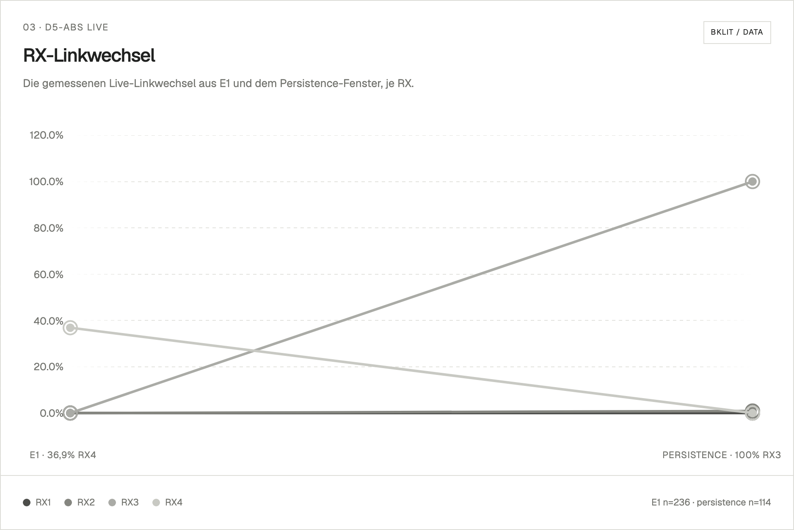
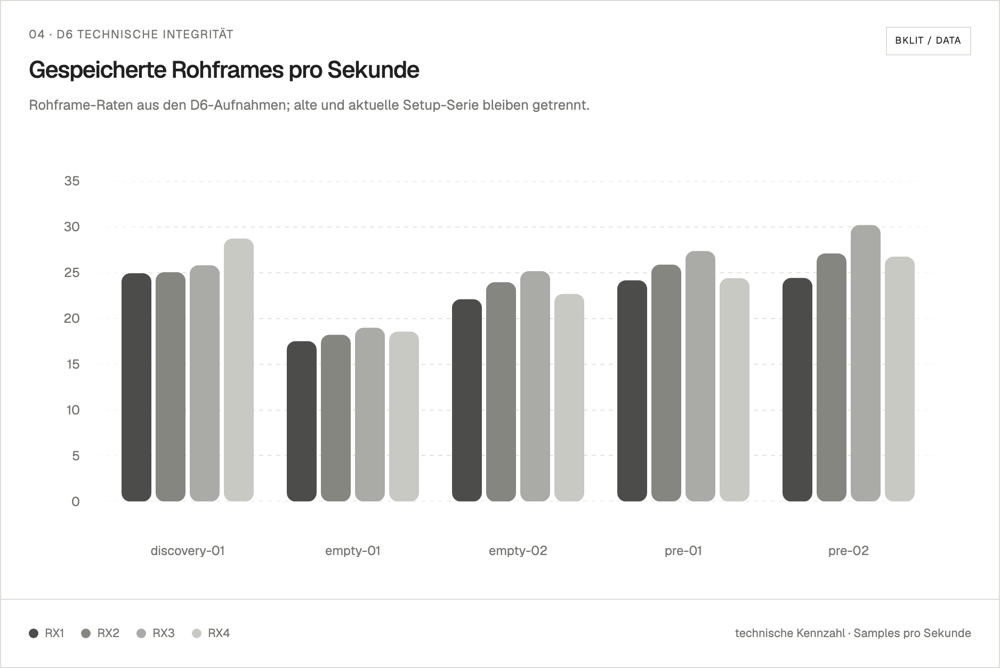
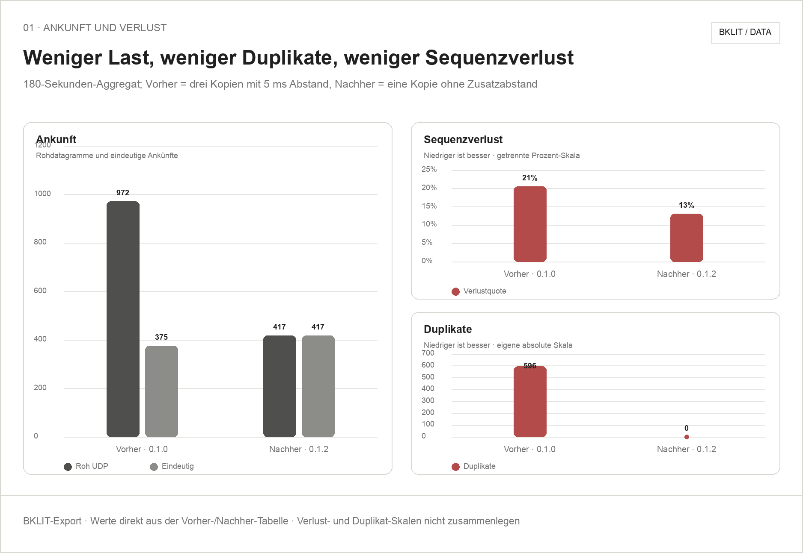
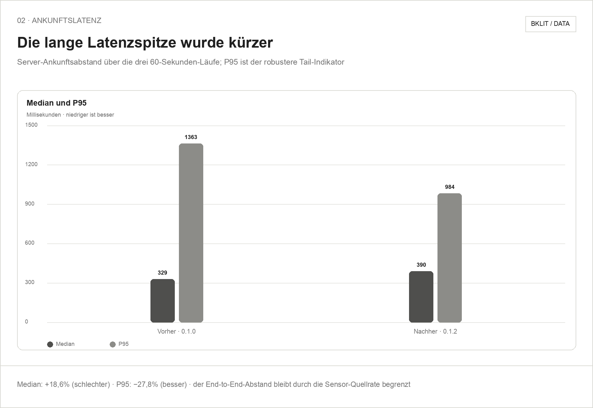
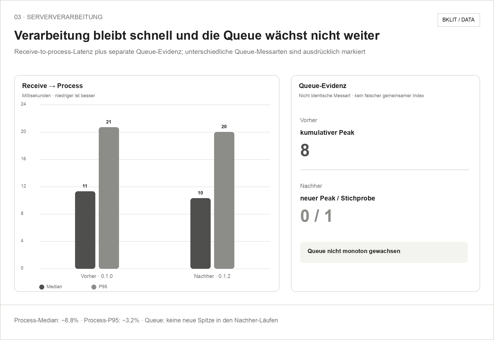
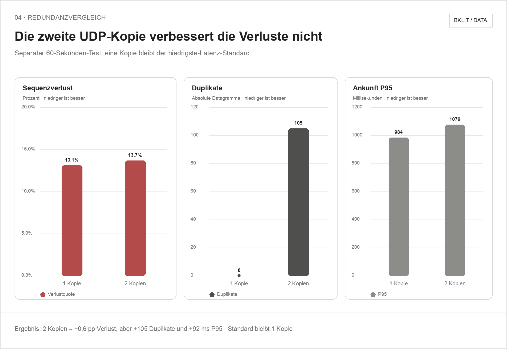

# Results overview

[Deutsch](README.md)

This page collects the checked D4/D5/D6 results, figures, and evidence files.
Raw data and detailed methodology remain in the linked reports.

## Source of truth

This root directory is the canonical source for measured BLL results.
`software/ruview/results/` remains a historical software snapshot containing
29 copied files; eight same-named files currently differ from their root
versions. They are not synchronized automatically or interpreted as newer
measurements. New or corrected result evidence belongs here only.

## Summary

- The technical discovery on August 9 captured `2,612` frames from RX1 through
  RX4 with `0` drops. This verifies transport, binding, and grid stability,
  not detection or positioning quality.
- Two historical sealed D6 preflights passed with `2,545` and `2,701` frames,
  respectively, with `0` drops in both runs.
- A 65-second empty-room calibration recorded `6,102` frames with `0` drops
  and passed strict offline inspection.
- The first real D5 still-presence live test achieved `0%` still recall. D5
  therefore remains disabled and experimental.
- Adding the ESP32-C3, PCB, and mmWave hardware later changed the physical
  setup; the current setup has not yet been sealed as setup v2.

> [!IMPORTANT]
> D5-abs lowers D4's global empty-room false presence from `75.2%` to `0%`, but also lowers still recall from `88.4%` to `0%`, so it **failed overall**. D6 is technically complete and setup-bound; this does not establish detection or positioning accuracy.

## D4/D5/D6 result figures

The [technical D4/D5/D6 report](2026-08-23_D4-D5-D6_technischer-ergebnisbericht.md)
is linked to the [25-capture run overview](2026-08-23_D4-D5-D6_laufuebersicht.csv),
[D4 RX diagnostics](2026-08-23_D4_RX_diagnostik.csv), and the
[figure contract and QA record](2026-08-23_D4-D5-D6_chart-map.md).
The current figures were rendered on 27 August 2026 with the official Bklit UI
charts; the [Bklit render specification](2026-08-27_D4-D5-D6_bklit-render-spec.md)
documents the data source, component choices, and QA. The maintained export is
in `D4-D5-D6_bklit/`; the redundant `..._figures` archive is no
longer kept in the canonical `results/` directory.

<table>
<tr>
<td> <strong>Global comparison</strong> D5-abs removes empty-room false presence but loses still recall, so the variant fails overall.</td>
<td> <strong>D4 RX empty-room heatmap</strong> False presence is local and shifts between RX paths; no single stable source is visible.</td>
</tr>
<tr>
<td> <strong>D5 live link changes</strong> Presence votes switch between RX3 and RX4, so the two-RX quorum is never reached and the still person is missed.</td>
<td> <strong>D6 RX frame rates</strong> All four RX paths appear in the five technical captures. This verifies capture and transport, not positioning accuracy.</td>
</tr>
</table>

## mmWave transport OTA comparison

The [before/after report](2026-09-13_mmwave-transport-ota-vergleich.md) contains
the controlled 60-second runs, the redundancy decision, and the interpretation
limits. Its Bklit exports are in
[`2026-09-13_mmwave-transport_bklit/`](2026-09-13_mmwave-transport_bklit/); the
[render specification](2026-09-14_mmwave-transport_bklit-render-spec.md)
documents the mapping and QA.

<table>
<tr>
<td> <strong>Arrival and loss</strong></td>
<td> <strong>Arrival latency</strong></td>
</tr>
<tr>
<td> <strong>Server processing</strong></td>
<td> <strong>Redundancy comparison</strong></td>
</tr>
</table>

## Key evidence

- [D5: offline replay and experimental presence calibration](2026-07-26_D5_offline-replay-und-experimentelle-praesenzkalibrierung.md)
- [D5: real still-presence live test](2026-07-26_D5_realer-still-livetest.md)
- [D6: setup capture and TX firmware identity](2026-08-09_D6_setupaufnahme-und-TX-firmwareidentitaet.md)
- [D6: setup seal and preflight](2026-08-09_D6_setup-siegel-und-preflight.md)
- [D6: sidecar fix, resealing, and empty-room calibration](2026-08-09_D6_sidecar-fix-neusiegelung-und-preflight.md)

All sums, sidecars, replay results, figures, and quality claims remain bound to
their respective setup series. No thresholds were changed for this
documentation.
