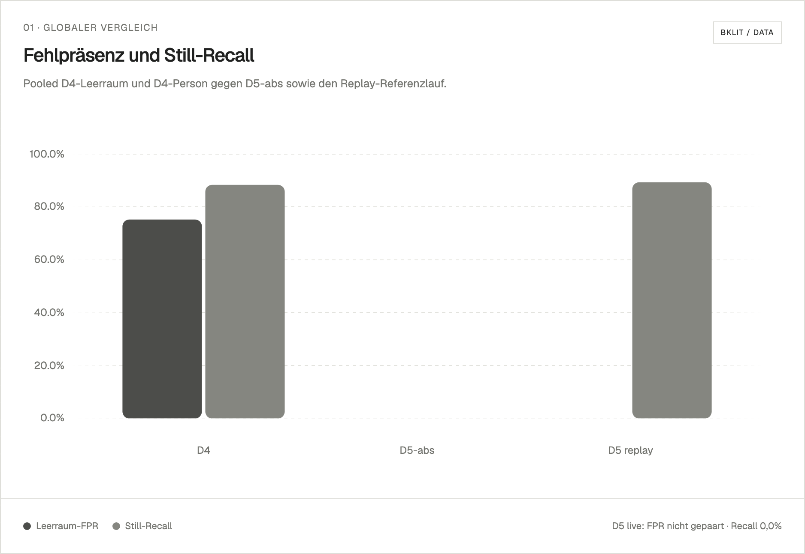
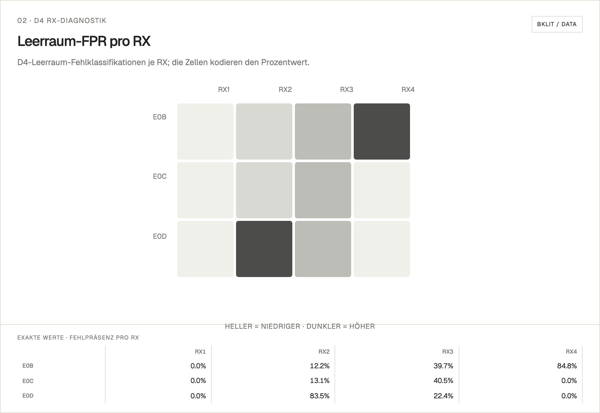

# Ergebnisübersicht

[English](README.en.md)

Diese Seite bündelt die geprüften D4/D5/D6-Ergebnisse, Diagramme und
Nachweisdateien. Rohdaten und ausführliche Methodik bleiben in den jeweils
verlinkten Berichten.

## Kurzfazit

- Die technische Discovery vom 9. August lieferte `2.612` Frames von RX1 bis
  RX4 bei `0` Drops. Das belegt Transport, Bindung und Rasterstabilität, nicht
  die Erkennungs- oder Positionsgüte.
- Zwei historische versiegelte D6-Preflights bestanden mit `2.545`
  beziehungsweise `2.701` Frames und jeweils `0` Drops.
- Eine 65-Sekunden-Leerraumkalibrierung schrieb `6.102` Frames bei `0` Drops
  und bestand die strikte Offline-Inspektion.
- Der erste reale D5-Still-Livetest erreichte `0 %` Still-Recall. D5 bleibt
  deshalb deaktiviert und experimentell.
- Durch die spätere Ergänzung von ESP32-C3, PCB und mmWave-Hardware ist der
  aktuelle physische Aufbau verändert und noch nicht als Setup v2 versiegelt.

> [!IMPORTANT]
> D5-abs senkt die globale Leerraum-Fehlpräsenz von D4s `75,2 %` auf `0 %`, senkt aber zugleich den Still-Recall von `88,4 %` auf `0 %` und ist insgesamt **nicht bestanden**. D6 ist technisch vollständig und setupgebunden; daraus folgt keine Aussage über Erkennungs- oder Positionsgenauigkeit.

## D4/D5/D6-Ergebnisdiagramme

Der [technische D4/D5/D6-Ergebnisbericht](2026-08-23_D4-D5-D6_technischer-ergebnisbericht.md)
ist mit der [Laufübersicht über 25 Aufnahmen](2026-08-23_D4-D5-D6_laufuebersicht.csv),
der [D4-RX-Diagnostik](2026-08-23_D4_RX_diagnostik.csv) und dem
[Diagrammvertrag inklusive QA](2026-08-23_D4-D5-D6_chart-map.md) verknüpft.
Die aktuellen Abbildungen wurden am 27. August 2026 mit den offiziellen
Bklit-UI-Charts gerendert; die [Bklit-Render-Spezifikation](2026-08-27_D4-D5-D6_bklit-render-spec.md)
dokumentiert Datenquelle, Komponentenwahl und QA. Die ursprünglichen
Diagramme bleiben im [Archivvergleich](2026-08-23_D4-D5-D6_figures/) erhalten.

<table>
<tr>
<td> <strong>Globaler Vergleich</strong> D5-abs entfernt die Leerraum-Fehlpräsenz, verliert dabei aber den Still-Recall. Deshalb ist die Variante insgesamt nicht bestanden.</td>
<td> <strong>D4-RX-Leerraum-Heatmap</strong> Die Fehlpräsenz entsteht lokal und wechselt zwischen den RX-Pfaden. Ein einzelner stabiler Verursacher ist nicht erkennbar.</td>
</tr>
<tr>
<td> <strong>D5-Live-Linkwechsel</strong> Die Präsenzstimmen wechseln zwischen RX3 und RX4. Das Zwei-RX-Quorum bleibt dadurch aus, und die stille Person wird nicht erkannt.</td>
<td> <strong>D6-RX-Frameraten</strong> Alle vier RX sind in den fünf technischen Aufnahmen vertreten. Das belegt Erfassung und Transport, aber keine Positionsgenauigkeit.</td>
</tr>
</table>

## Wichtige Nachweise

- [D5: Offline-Replay und experimentelle Präsenzkalibrierung](2026-07-26_D5_offline-replay-und-experimentelle-praesenzkalibrierung.md)
- [D5: realer Still-Livetest](2026-07-26_D5_realer-still-livetest.md)
- [D6: Setupaufnahme und TX-Firmwareidentität](2026-08-09_D6_setupaufnahme-und-TX-firmwareidentitaet.md)
- [D6: Setup-Siegel und Preflight](2026-08-09_D6_setup-siegel-und-preflight.md)
- [D6: Sidecar-Fix, Neusiegelung und Leerraumkalibrierung](2026-08-09_D6_sidecar-fix-neusiegelung-und-preflight.md)

Alle Summen, Sidecars, Replay-Ergebnisse, Diagramme und Qualitätsaussagen
bleiben an die jeweilige Setup-Serie gebunden. Es wurden keine Schwellenwerte
für diese Dokumentation verändert.
